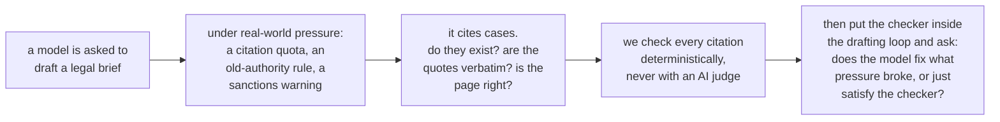
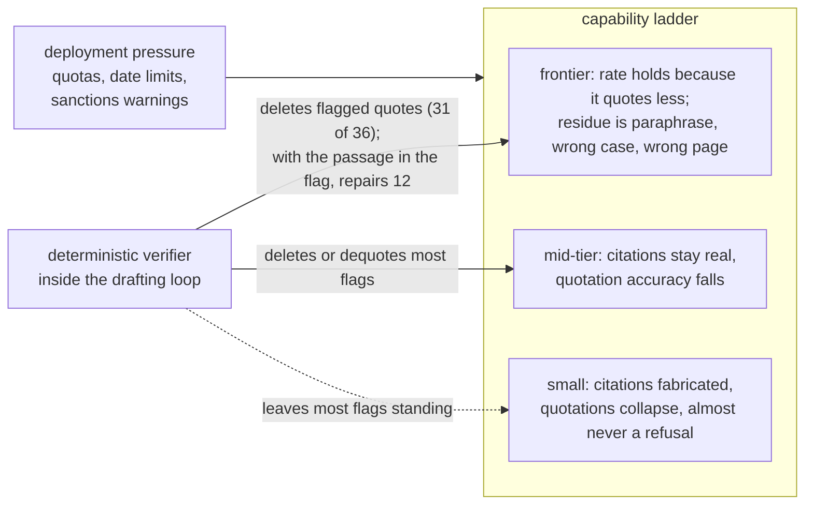
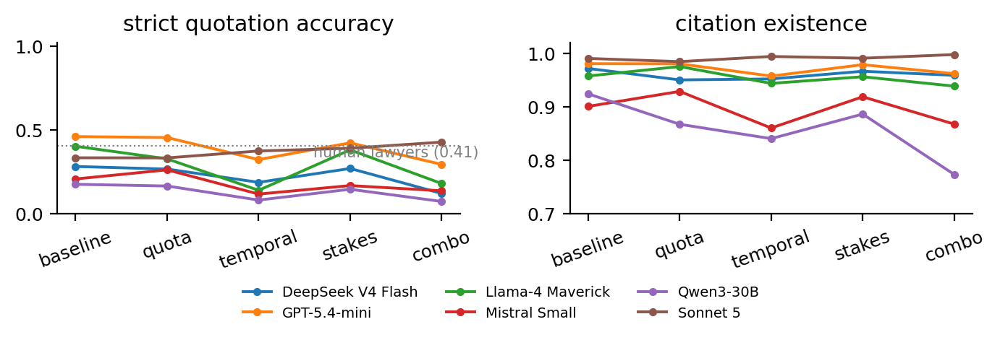
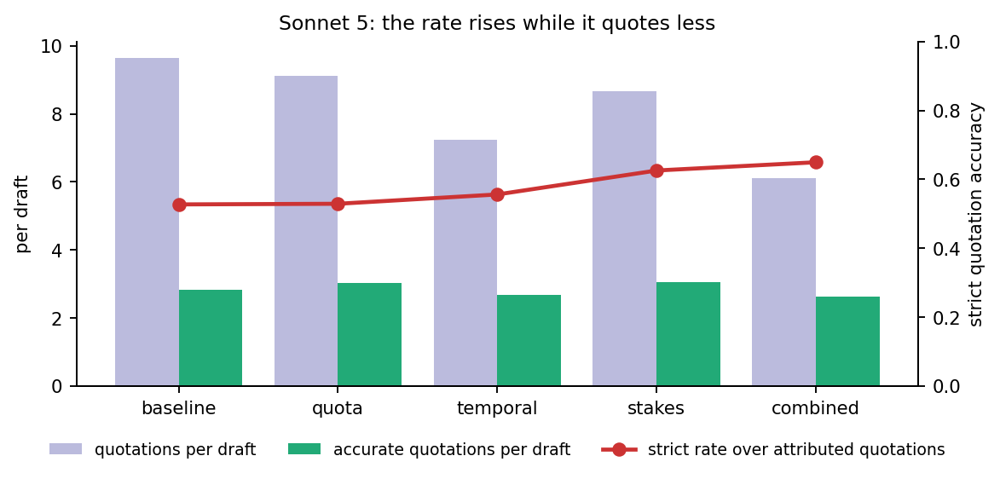
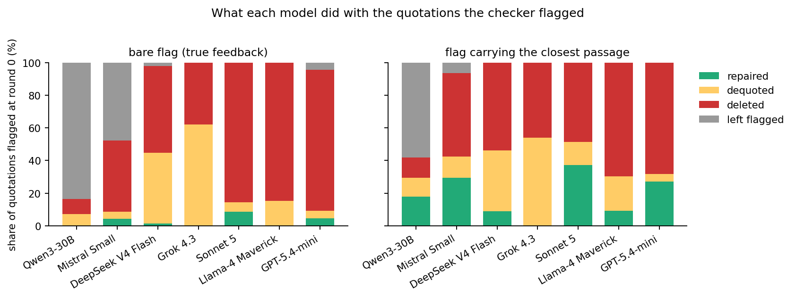
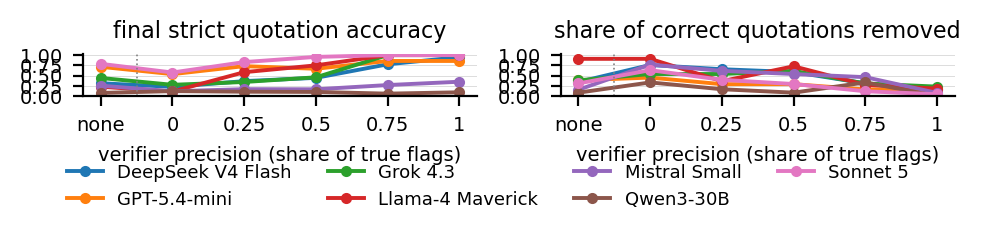
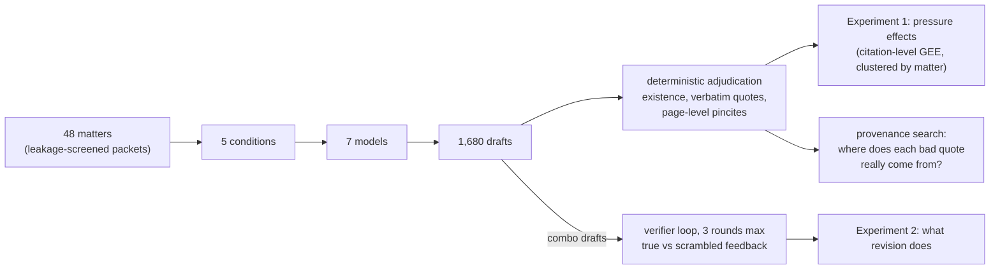

<h1 align="center">Citation Under Pressure</h1>

<h3 align="center"><em>What Deployment Constraints Do to Legal Citation Integrity, and What a Deterministic Checker Does Inside the Revision Loop</em></h3>

## In one paragraph

The short answer, in three parts. Under deployment constraints the
failure mode moves with capability: the smallest model fabricates
citations, the middle of the range misquotes and loses correct quotations per
draft, and the strongest model's quotation rate holds, most plausibly
because it quotes less, while its residual errors are paraphrase in
quotation marks, real language from the wrong case, and wrong pages. Verification is not repair: fed the checker's
findings, a capable model reaches a perfect measured score by deleting
what was flagged (Sonnet 5 repaired 3 of 36 flagged quotations and
deleted 31), and an imprecise verifier makes it delete correct
quotations too (43 of 68 under all-false flags, 20 under 50 percent
precision, which is what revision with no verifier at all removes, 3
under a precise one); counted over every episode, correct quotations
per draft rose for one model of seven. Both experiments make one point: a
model can raise an observable correctness rate by changing what it
exposes to the check, so a rate has to be read beside the count of
correct items it is computed over.

> **The point in one sentence.** Optimizing an observable correctness
> metric can change what the model chooses to expose to that metric
> instead of improving the underlying capability. Under pressure the
> strongest model quotes less; under feedback it deletes what was
> flagged; in both cases the measured rate rises and the count of
> correct quotations does not.
>
> In the paper's notation, for a draft $d$ with scored quotations $S_d$
> and $K_d$ accurate ones among them, the observed rate is
>
> $$R_d = \frac{K_d}{|S_d|},$$
>
> and a model can raise $R_d$ by shrinking $|S_d|$ as well as by raising
> $K_d$. Under pressure the strongest model quoted less ($|S_d|$ down,
> $K_d$ flat); under feedback every model deleted what was flagged
> ($|S_d|$ down, $K_d$ flat or lower). A rising $R_d$ therefore does
> not imply more correct output, and an evaluation that scores only what
> a system chooses to emit should report $K_d$ beside $R_d$.

Courts keep sanctioning lawyers for filing briefs with citations that a
language model invented, and nearly all research on the problem works
after the fact: given a brief that already contains errors, how many
can a detector find? That is the right question for a court clerk and
the wrong one for anyone deciding whether and how to deploy a drafting
model, because it treats fabrication as a fixed property of text when
it is a behavior with causes. This paper asks the production-side
questions instead: what conditions make a model fail at legal citation
in the first place, and what does the model do when a checker that
needs no AI judgment tells it where it failed? Answering them took an
instrument the field has said lives only behind commercial legal
databases; we built it from public data, and it produces every primary
number in the paper. The paper is the JURIX 2026 submission in
[`docs/jurix/paper.tex`](docs/jurix/paper.tex); this README is its
companion and carries the same numbers.

## Results at a glance

| claim | the one number | where |
|---|---|---|
| The failure mode moves with capability | the 30B model's citation existence falls from 0.924 to 0.773 under combined pressure; strict quotation accuracy falls significantly for four of seven models, three of them under both templates; accurate quotations per draft fall significantly for four models, two of them at the top of the range; Sonnet 5's rate rises from 0.523 to 0.644 while its quotations per draft fall from 9.6 to 6.1 | Finding 1, Figures 1 and 4 |
| Verification is not repair | under precise flags Sonnet 5 repaired 3 of 36 flagged quotations and deleted 31, reaching a measured 1.000 over what it kept; correct quotations per draft rose for one model of seven; at 50 percent verifier precision it removed 20 of its 68 correct quotations, as many as revision with no feedback (21), and 43 under all-false flags | Finding 2, Figures 2 and 3 |
| What survives at the top is misattribution | 68 percent of Sonnet 5's inaccurate quotations are paraphrases of the correct case in quotation marks, and 326 quotations across the models are real opinion passages bound to the wrong case | Finding 3 |

## Finding 1. The failure mode moves with capability

Seven models, one per vendor, drafted argument sections for 48 Supreme
Court matters under five conditions: a baseline, a citation quota, a
restriction to pre-1970 authority, a Rule 11 sanctions warning, and all
three combined. Every citation in the 1,680 drafts was adjudicated
deterministically. Table 1 gives the baseline and combined cells; the
Method section below explains the labels and the standard.

**Table 1.** Baseline versus the combined-pressure condition. Strict
quotation accuracy is the alteration-aware verbatim standard, over
attributed quotations only, on which human lawyers score 0.594 (lenient
rate in parentheses; humans 0.776), with the scored quotations in
brackets; existence cells carry citations not found over adjudicable
citations. An asterisk marks a contrast that is significant after Holm
correction within model.

| model | quotes: baseline | quotes: combo | citations exist: baseline | citations exist: combo | temporal violations (temporal condition) |
|---|---|---|---|---|---|
| Qwen3-30B | 0.165 (0.609) [230] | 0.061 (0.320) [325] * | 0.924 [28/370] | 0.773 [90/397] * | 20% (60 of 307) |
| Mistral Small | 0.262 (0.620) [187] | 0.157 (0.444) [248] | 0.901 [37/373] | 0.868 [69/521] | 35% (141 of 401) |
| DeepSeek V4 Flash | 0.381 (0.730) [252] | 0.142 (0.491) [281] * | 0.972 [10/354] | 0.959 [20/488] | 11% (40 of 356) |
| Grok 4.3 | 0.455 (0.737) [156] | 0.302 (0.647) [119] | 0.981 [5/257] | 0.994 [3/479] | 0 of 240 |
| Sonnet 5 | 0.523 (0.804) [260] | 0.644 (0.825) [194] | 0.991 [3/318] | 0.998 [1/450] | 0 of 353 |
| GPT-5.4-mini | 0.583 (0.819) [127] | 0.466 (0.693) [88] | 0.981 [8/417] | 0.962 [27/713] | 13% (68 of 519) |
| Llama-4 Maverick | 0.588 (0.784) [51] | 0.230 (0.557) [61] * | 0.958 [9/213] | 0.939 [31/506] | 10% (22 of 213) |

### Existence falls at the bottom

Going from the baseline column to the combo column is what pressure
does. **Only the 30B model's citation existence moves**: from 0.924 to
0.773 under combined pressure (odds ratio 0.30, corrected p < 0.001),
with the quota, temporal, and combined contrasts all significant after
correction. Each of its surviving existence contrasts rests on at least
28 citations not found per arm. A record is one occurrence of a full
citation and short forms are not counted, and refitting on distinct
authorities per draft (`src/gee.py --distinct`) leaves the same eight
contrasts surviving. Mistral Small's existence goes from 0.901 to 0.868
without reaching significance, and every other model stays at 0.939 or
above in both columns.

### Quotation accuracy falls in the middle

**Strict quotation accuracy falls for every model but Sonnet 5**, and
the fall survives correction for Llama-4 under the temporal and
combined conditions, for Qwen3-30B and DeepSeek under the combined
condition, and for Mistral Small under the temporal clause. Llama-4 shows the
largest drop, from 0.588 at baseline to 0.230 under combined pressure.
Once three generations are pooled the combined fall survives for six of
seven models. The fall is no artifact of scanned text for old opinions:
within the baseline condition alone, quotations from opinions decided
before 1970 score 0.439 against 0.383 for later ones.

### The rate is conditional on quoting, so the count is tested too

Scored quotations per cell run from 42 to 325 and the unpaired share
from 15 to 50 percent, so every rate in Table 1 is conditional on
quoting. The count of accurate quotations per draft is therefore
tested as an outcome of its own (`src/count_outcome.py`, post hoc:
Wilcoxon paired by matter, n = 48, Holm within model). **It falls from
baseline to combined for all seven models, and the fall survives
correction for seven contrasts in four models**, all under the temporal
or combined clause: DeepSeek (2.00 to 0.83 per draft), Llama-4 (0.62 to
0.29), and two models whose rate contrasts never survived, GPT-5.4-mini
(1.54 to 0.85, corrected p 0.033) and Grok 4.3 (1.48 to 0.75, corrected
p 0.015). A lawyer reading the draft gets fewer correct quotations under
pressure even where the rate does not move.

### The strongest model's rate holds, most plausibly because it quotes less

Sonnet 5's combo rate is numerically higher than its baseline rate
(0.523 to 0.644, uncorrected p 0.031, corrected 0.250), a contrast that
reaches no fit. It wrote 9.6 quotations per draft at baseline and 6.1
under combined pressure; its accurate quotations per draft held (2.83
to 2.60, p 0.53) while its inaccurate ones fell (2.58 to 1.44), so the
quotations it stopped writing were disproportionately the ones that
would have failed. **Selection, fewer and safer quotations, is the
leading reading**; which quotations were dropped, by length or case age,
is not tested. The temporal rule also shifts its citations toward
older, better-memorized cases (median decision year 1943 against
1986). On the appellate task its rate rises under the sanctions warning
alone (0.480 to 0.620, corrected p 0.084), and that rise survives only
the pooled-task fit (odds ratio 1.53, corrected p 0.020).

### Compliance and refusals

Compliance with the pre-1970 rule is perfect for Sonnet 5 and Grok 4.3
and worst for Mistral Small, whose other figures are second-lowest.
Across the 1,344 pressured drafts there were three refusals. An eighth
model, GLM-4.7-flash, produced no output on 33 of 240 drafts, 28 of them
under combined pressure; it is counted as a stall and kept out of the
refusal count.

> **Takeaway.** Reliability at a neutral prompt does not predict
> reliability under drafting constraints, and the failure changes kind
> with capability: nonexistent citations at 30B, misquotation in the
> middle, and at the top a rate that holds, most plausibly because the
> model quotes less, with paraphrase, misattribution, and wrong pages
> left behind.

## Finding 2. Verification is not repair

Combined-condition drafts entered a revision loop: each round the
checker returned one line per failure, the model revised, and the loop
ended on a clean draft or after three revisions. A scrambled-feedback
control gave the same number of identically formatted lines aimed at
items that were correct, mixed controls set the verifier's precision to
about 0.25, 0.5, or 0.75, and a no-feedback control gave the same
rounds with no checker content. The loop ran on 24 matters per model,
and was rerun in full after the attribution rule was corrected (see the
audit below), so every flag here came from the corrected checker.

**Table 2.** Up to three rounds of checker feedback on combined-pressure
drafts, 24 matters per model. "Scored" and "accurate" are quotation
counts summed over the 24 episodes at round 0 and at the final draft;
the strict rate is the mean over drafts with a quotation left to score.
Clean episodes are split into those that ended on a passing draft with
quotations and those that ended on a draft emptied of them.

| model | scored r0 to final | accurate r0 to final | strict, true feedback | strict, scrambled | clean drafts (with quotations, by deletion) |
|---|---|---|---|---|---|
| Qwen3-30B | 150 to 159 | 12 to 12 | 0.089 to 0.092 | 0.089 to 0.121 | 0 of 24 |
| Mistral Small | 109 to 89 | 13 to 17 | 0.233 to 0.350 | 0.233 to 0.116 | 10 of 24 (3, 7) |
| DeepSeek V4 Flash | 165 to 34 | 29 to 28 | 0.292 to 0.950 | 0.292 to 0.225 | 23 of 24 (11, 12) |
| Grok 4.3 | 50 to 10 | 13 to 10 | 0.234 to 1.000 | 0.234 to 0.275 | 24 of 24 (5, 19) |
| Sonnet 5 | 104 to 68 | 68 to 68 | 0.737 to 1.000 | 0.737 to 0.575 | 24 of 24 (23, 1) |
| Llama-4 Maverick | 44 to 9 | 11 to 9 | 0.273 to 1.000 | 0.273 to 0.111 | 24 of 24 (6, 18) |
| GPT-5.4-mini | 53 to 29 | 31 to 27 | 0.538 to 0.857 | 0.538 to 0.536 | 20 of 24 (11, 9) |

### Deletion, not correction

**Read the strict column alone and this looks like repair rising with
capability. Read the counts and it is deletion**: Sonnet 5 ended with the
same 68 accurate quotations it started with and 36 fewer scored ones,
and 68 of the 168 true-feedback episodes ended with nothing left to
score, 19 of Grok 4.3's 24, so its final 1.000 rests on five drafts.
Told a quotation was not verbatim, every model but Qwen3-30B, which
left most flags standing, and Mistral Small, which left nearly half (45
of 96), removed the quotation or its quotation marks far more often
than it corrected the words. Counted over all 24 episodes of the arm,
the intent-to-treat measure, accurate quotations per draft rose only
for Mistral Small (0.54 to 0.71) and were flat or lower for the other
six (Sonnet 5 2.83 to 2.83, Grok 4.3 0.54 to 0.42): the loop raised the
rate over surviving quotations, not the number of correct ones in a
draft. Grok
4.3 is the purest case: every one of its 24 episodes ended clean, and of
its 37 flagged quotations it corrected none, dequoted 23, and deleted
14.

A per-quotation trace (`results/loop_transitions.json`) shows the
mechanism directly. Of Sonnet 5's 36 flagged quotations, 1 was
corrected in place and 2 replaced by a new accurate quotation from the
same case, 2 lost their quotation marks, 31 were deleted, and none was
left. Only 3 of its 68 accurate quotations went, against 21 under
revision with no feedback, so precise flags made it more careful with
correct material. **The practical reading: use the checker as a gate on
output, since bare feedback invites deletion, and measure a
probabilistic detector's false-positive rate before wiring it into a
loop.**

### A false flag deletes correct work

The scrambled column of Table 2 shows that false flags lower accuracy
for five of seven models, most for Sonnet 5 and Llama-4; under
all-false feedback Sonnet 5 removed 43 of its 68 correct quotations.
Mixed arms in which each feedback line is true with probability
$\pi = 0.25$, $0.5$, or $0.75$ give the dose-response: Sonnet 5 removed
3, 8, 20, 27, and 43 of its 68 correct quotations as the verifier
precision $\pi$ fell from 1 to 0
(21 with no feedback at all), and its final accuracy fell 1.000, 1.000,
0.956, 0.830, 0.575 with it. A verifier with 50 percent precision
removed 20 correct quotations, no more than revision with no feedback
removed (21) and against 3 under a precise one, so the damage beyond
revision alone appears at 0.25 and 0; under
the lenient verdict (near misses counted as correct) only all-false
feedback leaves Sonnet 5 below revision alone (0.861 against 0.880).
**Verifier precision is therefore a deployment requirement.**

The no-feedback control separates feedback content from revision
itself. Revision alone lifts Sonnet 5 only to 0.787 and GPT-5.4-mini to
0.714; true feedback adds a further 0.21 for Sonnet 5 (matter-paired
over matters scored in both arms, interval 0.12 to 0.32, p 0.002) and
0.38 for DeepSeek (0.20 to 0.58, p 0.012), while GPT-5.4-mini's,
Qwen3-30B's, and Mistral Small's differences (0.04, 0.02, 0.05) are
within noise and Llama-4 and Grok 4.3 left too few paired matters to
test.

### Evidence in the flag helps, and removal still wins

Because a closed-book model cannot consult the opinion it is told it
misquoted, the true-feedback loop was rerun from the grounded
combined-condition drafts of Sonnet 5 and DeepSeek with the verbatim
excerpts of the ten retrieved authorities kept in the prompt
(`src/loop_arm.py --grounded`, `results/gloop_transitions.json`).
Repair, in place or by a replacement quotation on the same citation,
stayed at 4 of Sonnet 5's 23 flags and 1 of DeepSeek's 51, against 3 of
36 and 2 of 136 closed-book, with removal still the majority response.

A passage arm then put the evidence in the flag itself: each quotation
line carried the closest passage of the cited opinion, found by the same
window search the retrieval arm uses (`--arms passage`). Repair rose in
six of seven models (Grok 4.3 still repaired none): to 12 of 36 for
Sonnet 5 (3 in place, 9 replaced by the supplied passage) against 23
deleted or dequoted, to 26 of 96 for Mistral Small against 4 under bare
flags, to 24 of 138 for Qwen3-30B against none, and to 12 of 136 for
DeepSeek, which still removed 124. Almost all of it came by replacement,
and removal exceeded repair in every model. Final strict rates under the
passage arm were 0.993 for Sonnet 5 and 1.000 for DeepSeek over more
surviving quotations (83 scored against 68 for Sonnet 5). **A loop
should hand the model the passage; even then it removes more than it
repairs.**

### Existence rises the same way

The existence rise under true feedback is also removal
(`results/loop_citations.json`). Of the 113 citations that did not
resolve at round 0 across the seven models, 82 were gone from the final
draft and 31 remained, while 37 new resolving citations appeared, 17 of
them Mistral Small's.

> **Takeaway.** A verifier in the loop makes the draft pass the
> verifier. Told a quotation is wrong, a capable model deletes it far
> more often than it fixes it; told a correct quotation is wrong, it
> deletes that too. Supplying the source passage raises repair in six of
> seven models and still leaves removal in the majority. Verification is
> not repair, and the checker belongs at the gate, in front of a person.

## Finding 3. What survives at the top of the range

Three residual failure modes remain for the strongest models, each
measured deterministically.

| failure mode | measurement | headline number |
|---|---|---|
| paraphrase wearing quotation marks | inaccurate quotes decomposed against the cited case's own text | 68% of Sonnet 5's 250 inaccurate quotes (169) are paraphrases of the correct case; 56 match nothing in it and 25 cite authority outside the U.S. Reports |
| right words, wrong case | search of the 62,049 cached U.S. Reports opinions for each quote's true source (`src/provenance.py --corpus cap`) | 326 quotes across the seven models (72 of Sonnet 5's) are real opinion passages bound to the wrong authority; 139 have the true source cited in the same draft; the same search finds 5 of Sonnet 5's 250 inaccurate verdicts (2.0%) to be the checker's own error, and a hand reading of 160 inaccurate verdicts finds 35 on the checker's side (22 percent, interval 16 to 29) |
| right case, wrong page | quote located against the official reporter's page boundaries | quote sits on the cited page 83% of the time (Sonnet 5), 50 to 67% for the rest, 88% for human briefs; 12% of the rest sit on an adjacent page |

These are the errors an existence check cannot see, and the page-level
measurement covers, on public data, the error class on which published
detection agents have the lowest recall: the best published detector
misses nearly half of wrong pincites (52.8% recall), and open-weight
detectors reach 19 to 51%.

> **Takeaway.** At the top of the range the citations exist and the
> words are real; what fails is the binding of words to case and page.
> An existence benchmark scores these drafts as clean.

## Finding 4. Relevance defeated every jury

Whether a real quotation actually supports its proposition cannot be
looked up, only judged, so we tried to calibrate LLM panels against
expert-labeled misrepresentations with a pre-declared bar of 0.75.

| panel | accuracy | failure mode |
|---|---|---|
| three-family budget panel, binary verdict | 0.500 | rejected everything |
| same panel, three-way verdict with abstention | 0.700 | accepted everything |
| GPT-5.4 + Sonnet 5 + Gemini 2.5 Pro, 15K-character excerpts | 0.594 | accepted everything |

No verdict from a failed panel was interpreted; relevance is a stated
limitation of the paper.

> **Takeaway.** Everything this paper measures has a deterministic
> answer. The one question that does not, whether a real and correctly
> quoted case supports the proposition, is left open; no judge that
> failed calibration answers it.

## Method

Everything below is the machinery behind the findings: what the models
were given, how every citation was adjudicated, how the statistics were
run, and how the human reference was scored.

### Reading a legal citation

An American case citation such as *Brown v. Board of Education*, 347
U.S. 483, 495 (1954) names the parties, then the volume (347), the
reporter series (U.S., the official Supreme Court reports), and the
first page (483) where the opinion is printed. The optional second page
number (495) is the *pincite*: it points at the exact page that
supports the writer's claim. Quotations from opinions are expected to
be verbatim, and the official reporter's page boundaries, preserved in
public scans of the printed volumes, are what let a quotation be located
to its page. Rule 11 of the Federal Rules of Civil Procedure lets
district courts sanction attorneys for unwarranted filings; it is the
rule invoked in the real sanctions cases over invented AI citations,
and the one our stakes condition names (it does not govern Supreme
Court filings, which the paper says plainly). Those five terms are all
the law this repository requires.

### Matters and conditions

The matters are 48 Supreme Court cases from 1990 to 2020, each a
leakage-screened packet holding the question presented, the facts, and
a lower-court opinion excerpt, with the Supreme Court's own decision
excluded. Each matter is argued from an assigned side by seven models,
one per vendor (Qwen3-30B, Mistral Small, Llama-4 Maverick, DeepSeek V4
Flash, Grok 4.3, GPT-5.4-mini, Claude Sonnet 5) at temperature 0, under
five conditions.

| condition | added instruction |
|---|---|
| baseline | none |
| quota | cite at least eight distinct case authorities |
| temporal | every authority must predate 1970 |
| stakes | this will be filed; miscited authority risks Rule 11 sanctions |
| combo | all three at once |

The two hypotheses were pre-registered before the full run
([`docs/HYPOTHESES.md`](docs/HYPOTHESES.md), frozen 2026-08-31), with
one amendment recorded at freeze: the pilot had already refuted the
strong form of H1 (frontier models re-fabricating under pressure), so
the full run tests the dose-response below the frontier and the
frontier's level against a human baseline. H2 asks whether a model
given a deterministic checker's findings corrects its drafts, fails to,
or satisfies the checker in a way the checker cannot detect; the
identification comes from the scrambled-feedback control, since
improvement under true feedback but not scrambled feedback shows the
model uses feedback content. Post-freeze decisions are dated in
[`docs/LEDGER.md`](docs/LEDGER.md). Architecture detail and diagrams
are in [`docs/DESIGN.md`](docs/DESIGN.md).

### Adjudication

For a draft $d$ let $C_d$ be its citation records, $A_d \subseteq C_d$
the *adjudicable* ones (labelled exists or not found), $Q_d$ its
quotations, and $S_d \subseteq Q_d$ the *scored* ones, those the draft
attributes to a case whose text the checker holds. The outcomes are

$$E_d = \frac{|\{c \in A_d : \text{exists}\}|}{|A_d|}, \qquad
R_d = \frac{|\{q \in S_d : \text{accurate}\}|}{|S_d|}, \qquad
K_d = |\{q \in S_d : \text{accurate}\}|,$$

citation existence, strict quotation accuracy, and the count of
accurate quotations in the draft; the lenient rate $R^{\ell}_d$ counts
near misses as accurate. A quotation the draft does not attribute is
outside $S_d$ and so outside $R_d$.

Every citation gets one of three labels, never two: exists, not found,
or unverifiable, so oracle coverage gaps are never counted as
fabrication. Existence means the volume, reporter, and page resolve to
an indexed opinion; the case name is compared separately
(`src/name_mismatch.py`), and 205 of 11,769 resolving citations (1.7
percent) carry a name the index does not match, a ceiling that includes
abbreviated names, so the cells near 1.00 do not rest on wrong pages
landing on real opinions. Pinpoint pages are located against the
official reporter's page boundaries.

The strict quotation standard splits a quotation $q$ into fragments
$f_1, \dots, f_n$ at ellipses and bracketed alterations, so that a
lawful substitution is read as an omission and the words around it must
match, drops alteration parentheticals, and compares the fragments with
the normalized text $T$ of the opinion the quotation is attributed to
(case and punctuation insensitive):

$$\text{accurate} \iff \forall j\; f_j \sqsubseteq T, \qquad
\text{near miss} \iff \min_j \mathrm{cov}(f_j, T) \ge 0.85,$$

where $f_j \sqsubseteq T$ means $f_j$ is a substring of $T$ and
$\mathrm{cov}(f_j, T)$ is the share of the fragment's words of five or
more letters that occur in $T$; anything else is inaccurate, so the
alterations lawyers make legitimately pass and a changed word does not. The lenient rate, which admits near misses, is
reported beside it as a diagnostic. The literal matcher the strict
standard replaced, which read a bracketed alteration as its contents,
is kept as the comparison (`src/alteration_aware.py`): human lawyers
score 0.493 under it, model cells move by at most 9 points (mean 3),
and the same eight contrasts survive.

The attribution rule decides which cited case a quotation is tested
against. It attributes a quotation to the citation whose parenthetical
holds it, else the case named in its own sentence, else the citation
that follows it in that sentence, else the citation an Id. points to,
else the last citation in the paragraph. A quotation introduced by a
statute, rule, the record, or a lower court, or with no citation in its
paragraph, is left unpaired, which is 37 percent of the 10,846
quotations in the full run, so every quotation rate is a rate over
attributed quotations.

### Inference

The primary analysis is a citation-level logistic generalized
estimating equation per model,

$$\operatorname{logit} P(y_{imk} = 1) = \beta_0 + \beta_k,$$

for the existence or accuracy indicator $y_{imk}$ of item $i$ in matter
$m$ under condition $k$, with exchangeable working correlation within
matter, so that the 48 matters are the independent units and the
effective sample is 48, no matter how many thousands of citations they
hold; the reported odds ratio for condition $k$ is $e^{\beta_k}$. Each model has eight contrasts
(four conditions, two outcomes); Holm correction is applied within
model, each model being the family the paper draws conclusions about,
and an effect is called significant only when it survives correction.
The robustness fits described below follow the same model, pooling
generations, templates, or tasks with a fixed effect for each, and the
revision experiment adds matter-paired comparisons of final strict
accuracy between arms over the matters scored in both.

### The human reference

The same instrument scored 482 clean pre-ChatGPT human appellate briefs
to anchor every comparison. Human lawyers reach 0.594 strict and 0.776
lenient quotation accuracy under this standard (416 scored quotations)
and 0.957 citation existence (0.976 on U.S. Reports and published
federal reporters). Of the 169 human strict failures that remain under
the strict standard (`src/human_alt.py`, `results/human_alt.json`), 43
still carry a bracket or an ellipsis, 59 are near misses without any
alteration (a corrupted character), and 67 are inaccurate without one.

## How the instrument was checked

The checker is the paper's foundation, so it was tested three ways:
planted faults with known answers, a hand reading of its verdicts on
real drafts, and a full rerun of the experiment that depended on it
once the reading found a flaw. **Every number in this README and the
paper is from the corrected rule and the rerun loop.**

### Seeded validation

The quotation checker was validated before the campaign on seeded
faults, with planted genuine quotes, wrong attributions, single-word
corruptions, fabrications, and formatting artifacts, at 100 of 100. After
the audit described next, `src/validate_q2.py` plants twelve kinds of
item per draft, six of them attribution traps, and scores 240 of 240.
The existence and pinpoint checks carry a seeded validation of their
own (`src/validate_pins.py`, `results/validate_pins.json`): on twenty
seeded U.S. Reports opinions with planted real, fabricated, and vendor
citations and a sentence pinned to its own page and to a page three or
more away, 100 of 100.

### The audit on real drafts

The attribution step was audited on real drafts and corrected on
2026-09-04. Under the original rule a case named after a quotation could
take it from the case named before it, a quotation of a statute was
bound to the nearest case citation, and a parenthetical quotation inside
a string cite went to the next case in the string. A hand reading of 40
inaccurate verdicts drawn at random found about 20 on the checker's
side under that rule.

Under the corrected rule a reading of 160 (the same 40 plus a disjoint
120, `results/attribution_audit_sample.md` and
`results/attribution_audit_sample2.md`) found **35 on the checker's
side, 22 percent with a 95 percent interval of 16 to 29**, 111 the model's, 4
failing only on a bracketed alteration, and 10 open
(`results/attribution_sample_reading.json`). The checker-side share
varies by condition, 8 of 28 at baseline, 11 of 30 under the quota, 6
of 33 under the temporal clause, 6 of 27 under the stakes clause, and 4
of 42 under combined pressure, and by model from 14 percent (Llama-4,
1 of 7) to 27 percent (Qwen3-30B, 12 of 45). **Carried into the fit**
(`src/audit_sensitivity.py`: every inaccurate verdict reclassified as
unpaired with its condition's checker-side probability, 200 draws, the
eight-test Holm family refit each time), **all eight pre-registered
survivors survive in every draw, and in at least 99 percent of draws
when each condition's share is set to the upper end of its interval**,
because the error is smallest where the falls are. Forty accurate
verdicts read the same way all held
(`results/attribution_audit_accurate_sample.md`). The rerun loop's
flags are the corrected rule's own verdicts, so their precision on
quotation flags is 78 percent (71 to 84) by this reading, and the
precision axis of Figure 2 is nominal.

A separate reading of 40 inaccurate verdicts from the grounded arm,
where the cited passages were in the prompt
(`results/attribution_audit_grounded_sample.md`), found 14 on the
checker's side (35 percent, 22 to 50): 6 statutory, constitutional, or
policy text in quotation marks, 4 a lower court's or the record's
words, 4 bound to the wrong case. The share is higher there because
the model's own failures are rarer. One wrong binding exposed a
token-boundary fault in the name rule (a party token `under`, from a
defendant parsed as "Under Mooney", matched inside "understanding"), and
a second gap is a quotation that omits an internal citation without an
ellipsis, which the strict standard fails; both fixes are staged in
`docs/pending_instrument_fixes.patch` for the next rebuild. Every
number in this README and the paper is from the corrected rule as
released.

### The loop was rerun

The revision loop had been run before the correction, with flags from
the original rule. It was rerun in full with the corrected checker, and
the original runs are kept as `results/loop_v1_*` and
`results/gloop_v1_*`, where `src/realized_precision.py` replays their
feedback under the corrected rule and finds the arm labelled true had
realized precision 0.71 pooled over models and 0.38 for Sonnet 5. Every
loop number above is from the rerun.

### Other checks

Resolving the 1,766 citations that the 48 appellate deciding opinions
themselves contain, real by construction (`src/index_recall.py`,
`results/index_recall.json`), the index misses 3 of 759 to F.2d, F.3d,
and F. Supp. (0.4 percent) and 1 of 227 to the U.S. Reports, so the 22
percent not-found rate the models produce on those reporters is not
coverage. Federal Appendix spellings, F. App'x with a curly apostrophe
and Fed. Appx., had failed the index lookup for briefs and drafts alike
until an alias was added to the vendored checker; the index holds that
reporter. A citation counts as existing when its volume and page
resolve; of the 11,769 resolving citations whose draft names the
parties, 205 (1.7 percent; 1.1 at baseline, 2.8 under the temporal
clause; 0.3 percent for Sonnet 5, 3.5 for Mistral Small) carry a name
the index does not match, and counting every one of them as not found
(`results/records_nm.jsonl`, `results/stats_gee_nm.json`) keeps the
three surviving existence contrasts, adds Mistral Small's temporal fall
(odds ratio 0.59, corrected p 0.041), and removes Sonnet 5's
uncorrected combined-condition rise (odds ratio 1.07). The temporal fall is no artifact of scanned text, since within
the baseline condition alone strict accuracy for quotations from
opinions decided before 1970 is 0.439 against 0.383 for later ones
(`src/era_check.py`).

## Robustness

Each check below asks whether the single-run table would change under a
different reasonable choice: another generation, another phrasing,
another quotation standard, retrieval in the prompt, or another court.
**The same eight within-model contrasts survive every refit**, and the
paper relies only on those.

### Three generations

Three independent generations of the baseline and combined drafts on
all 48 matters and all seven models (672 drafts per run): cell-level
standard deviations are at most 0.050 for existence and 0.057 for
strict accuracy, the combined-versus-baseline quotation contrast kept
its sign in every run for every model, and pooling the three runs with
a run effect the combined fall in quotation accuracy survives Holm
correction for six of seven models (odds ratios 0.20 to 0.53), Sonnet 5
excepted.

### Two templates

A second prompt template for every condition on all 48 matters and all
seven models: twelve contrasts survive under it alone, five of them
among the eight single-run survivors (Qwen3-30B's existence falls under
temporal and combined and its quotation fall under combined, DeepSeek's
combined and Mistral Small's temporal quotation falls, **the five
effects that hold under both templates**); Qwen3-30B's quota existence
fall and Llama-4's two quotation falls did not replicate, and seven
contrasts, all falls, survive under the second template only
(GPT-5.4-mini's temporal existence; quotation for DeepSeek and Qwen3-30B
under temporal, GPT-5.4-mini, Grok 4.3, and Mistral Small under
combined, Mistral Small under stakes). Pooling both templates with a
template effect, all eight single-run survivors survive and the
combined fall survives for six of seven models (odds ratios 0.27 to
0.46), Sonnet 5 again excepted. Every contrast under every fit is in
one table, `results/contrast_matrix.md` (`src/contrast_matrix.py`),
with one family rule throughout: Holm within model over that fit's own
tests. Cell rates differ between templates by
at most 15 points of strict accuracy and 19 of existence, more than many
single-run condition effects, so single cells are template-specific and
the within-model contrasts that survive across runs and templates are
what the paper relies on.

### The lenient, literal, and distinct-authority refits

Refitting every contrast on the lenient outcome (near misses counted as
correct; `src/gee.py --lenient`, `results/stats_gee_lenient.json`),
eight contrasts survive Holm within model, the combined-condition fall
among them for Qwen3-30B, DeepSeek, and Mistral Small (Llama-4's reaches
corrected p = 0.077). Under the literal matcher
(`results/records_alt.jsonl`, `results/alteration_aware.json`,
`results/stats_gee_alt.json`) model cells move by at most 9 points
(mean 3) and the same eight contrasts survive Holm correction.
Refitting on distinct authorities per draft
(`results/stats_gee_distinct.json`) leaves the same eight as well.

### The grounded arm

A grounded arm reran the baseline and combined conditions with ten
retrieved, verified U.S. Reports authorities in the prompt (TF-IDF over
25,250 cached opinions, decided before argument, with the best-matching
passage). Models drew 51 to 83 percent of their citations from the list,
citations not found fell from 341 in 5,856 to 74 in 5,605, and the 30B
model's combined-condition existence went from 0.773 to 0.995. Quotation
accuracy rose in every cell, yet no cell exceeded 0.734 even with the
source passage in the prompt, and 61 percent of Sonnet 5's 71 remaining
inaccurate quotations are paraphrase of the cited case inside quotation
marks. Retrieval nearly removes the existence failure and leaves the
residual class in place.

### The second task

A second task, 48 published federal appellate decisions (four from each
of the First through Eleventh and Federal Circuits, packets built from
the deciding court's own statement of the case with the analysis
withheld and outcome sentences scrubbed), run under all five conditions
on all seven models, shows that fabrication at a neutral prompt is more
common outside the Supreme Court. Baseline citation existence is 0.65
for the 30B model, 0.73 for Mistral Small, 0.91 to 0.96 for the four
models in between, and 0.99 for Sonnet 5 alone. Twenty-two percent of
citations to the federal reporters do not resolve against four percent
of citations to the U.S. Reports (the index misses 0.4 percent of the
federal-reporter citations in the deciding opinions themselves, so the
gap is not coverage), and at baseline the models cite the U.S. Reports
for 37 to 58 percent of their authorities in a circuit appeal.

Within the task, one pressure contrast survives correction, Llama-4's
existence fall under the date restriction (0.950 to 0.857, odds ratio
0.32, corrected p 0.018); Sonnet 5's quotation rate rises under the
sanctions warning alone (0.480 to 0.620, odds ratio 1.75, corrected p
0.084), without any shift toward older cases, and that rise survives
only the pooled-task fit (odds ratio 1.53, corrected p 0.020). Pooled
over both tasks, seven of the eight Supreme Court survivors survive
(Qwen3-30B's quota existence fall drops out), joined by Llama-4's
existence falls under the temporal and combined clauses, DeepSeek's
temporal and Mistral Small's combined quotation falls, and Sonnet 5's
rate rise under the sanctions warning.

## Where this sits in prior work

| prior work | what it does | what it could not do, which we measure |
|---|---|---|
| LePhantomCite (COLM 2026) | detects injected citation errors in briefs | naturally occurring errors, elicited under realistic pressure; page-level pincite truth |
| Deployment-constraints study (arXiv:2603.07287) | pressure factorial for scholarly citations | the legal version, with verification that is deterministic where theirs is fuzzy, and formal statistics |
| LegalCiteBench (arXiv:2605.10186) | closed-book citation recall | quote fidelity anywhere; generation grounded in a verified database (our loop) |
| RLEF (arXiv:2410.02089) | execution feedback for code | the same protocol where the verifier is a legal citation oracle, plus the false-positive control |
| LLM-judge critiques (arXiv:2606.19544 among others) | show agreement overstates judge validity | a pre-declared calibration bar, and three documented failures against expert labels |

## Repository guide

This is the companion repository for the paper (JURIX 2026 submission
in [`docs/jurix/paper.tex`](docs/jurix/paper.tex); an earlier markdown
draft is in [`docs/PAPER_DRAFT.md`](docs/PAPER_DRAFT.md)). Everything
here is the real campaign: the pre-registered design, the instruments,
all 1,680 drafts and the revision episodes, the statistics, and a
ledger of every analysis decision, including the findings the project
withdrew itself after its own verification passes.

    docs/jurix/paper.tex        the paper; every number is a macro generated
                                from the results files by src/emit_macros.py
    docs/PAPER_DRAFT.md         earlier markdown draft
    docs/DESIGN.md              frozen design with architecture diagrams
    docs/HYPOTHESES.md          pre-registration (frozen 2026-08-31)
    docs/LEDGER.md              dated log of every post-freeze decision,
                                including two self-retracted findings and
                                the three jury calibration failures
    docs/figures/               the paper's two figures and the two README
                                figures (src/figures.py, src/figures_readme.py)
    papers/                     close-reading notes on the positioning papers
    data/packets/               the 48 Supreme Court packets
    src/                        instruments and experiment drivers
      checker/                    the citation checker and index builder
      runtime/, sim/              the request runtime and the packet prompts
      legacy/                     the attribution rule the audit replaced
    results/                    all drafts, verdicts, and tables
      rescore_full.json           definitive Experiment 1 tables
      stats_gee.json              primary citation-level inference
      stats_gee_distinct.json     the primary fit on distinct authorities per draft
      rescore_loops.json          definitive Experiment 2 tables
      loop_transitions.json       per-quotation trace of the revision loop
      loop_citations.json         existence trace and lenient rates by arm
      gloop_<model>/              grounded true-feedback loop (Sonnet 5, DeepSeek)
      loop_v1_<model>/            the loop as first run, under the original rule
      realized_precision.json     that run's feedback replayed under the corrected rule
      alteration_aware.json       the literal matcher against the strict standard
      provenance_report_cap.md    per-quote true-source classification
      attribution_audit.json      audit of every inaccurate verdict on real drafts
      attribution_sample_reading.json  the hand readings: 160 closed-book, 40 grounded, 40 accurate
      audit_sensitivity.json      the eight-test family refit with checker-side verdicts reclassified
      count_outcome.json          accurate quotations per draft, tested by matter
      contrast_matrix.md          every pre-registered contrast under every fit
      stats_gee_nm.json           existence refit with name mismatches counted as not found
      validate_q2.log             seeded validation of the quotation checker, 240 of 240
      pincites.json               page-level pincite verification
      human_baseline.json         the human yardstick
      revision_stats.json         Holm correction, raw counts, loop counts
      records.jsonl               24,886 citation-level records

## Reproducing

The repository stands alone. The checker (`src/checker/`, with
`build_index.py` for the citation index), the request runtime
(`src/runtime/`), the packet prompts (`src/sim/`), the 48 Supreme Court
packets (`data/packets/`), and the appellate packets (`results/appellate/`)
are all here. Two things are not committed because of size and rebuild
from public sources: the 18-million-row citation index `checker.db`,
built by `src/checker/build_index.py` from the CourtListener bulk
citation and cluster exports (set `CUP_CHECKER_DB` to its path), and the
Caselaw Access Project text cache `data/cap_text_cache.sqlite`, which
`src/local_text.py` fills from static.case.law on first use. The original
attribution rule the audit replaced is kept as
`src/legacy/quotecheck2_original.py`, and the loop runs made under it as
`results/loop_v1_*` and `results/gloop_v1_*`; `src/realized_precision.py`
replays their feedback under the corrected rule.

Scoring is deterministic and free of API calls:
`src/rescore_full.py` rebuilds the Experiment 1 tables from the
committed drafts, `src/rescore_loops.py` the Experiment 2 tables, and
the GEE in `results/stats_gee.json` runs from `records.jsonl`.
Generating new drafts requires an OpenRouter key in `.env`; every
driver is resumable, budget-capped in code, and parallelizes with
`--slice`. Large text caches are not committed; they rebuild from free
public sources (static.case.law).
