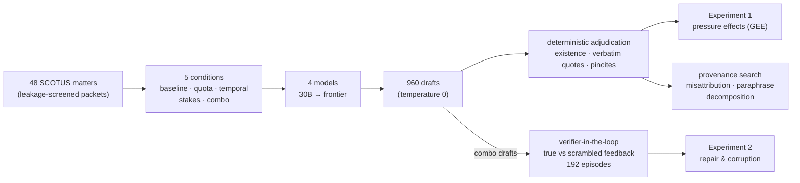
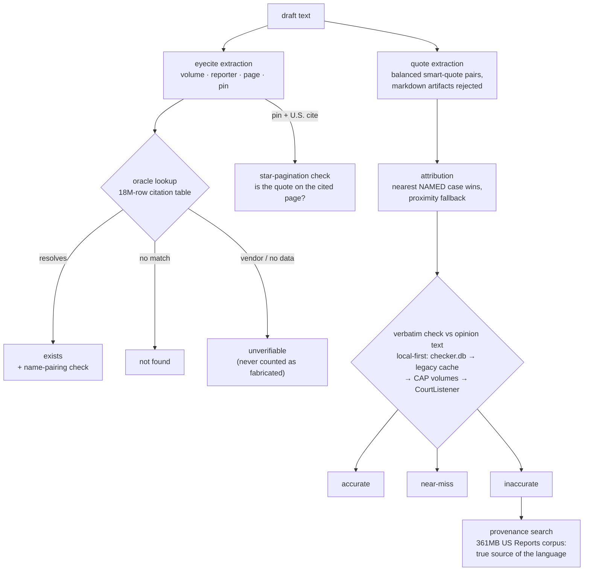

# Citation Under Pressure

**What deployment constraints do to legal citation integrity in language
models, and what deterministic verification can and cannot repair.**

This repository contains a complete, pre-registered measurement campaign
behind the paper draft in `docs/PAPER_DRAFT.md`. Four language models
spanning a capability ladder (Qwen3-30B, DeepSeek V4 Flash, GPT-5.4-mini,
Claude Sonnet 5) each drafted merits-brief argument sections for 48
leakage-screened U.S. Supreme Court matters under five deployment
conditions. Every citation in the resulting 960 drafts was adjudicated
**deterministically** — existence against an 18-million-row reporter
database, quotations against a verbatim checker validated on seeded
faults (100/100), pinpoint pages against true star pagination from free
Caselaw Access Project volumes. No LLM judge produced any primary number.

## What the paper shows

1. **Pressure breaks citation integrity from the bottom of the
   capability ladder up, silently.** Under a citation quota, a
   pre-1970-authority restriction, and a sanctions warning stacked
   together, the 30B model loses 15 points of citation existence
   (OR 0.30, p < 0.0001) and its quote fidelity collapses to a twentieth
   of the human-lawyer baseline. Quote fidelity degrades significantly
   at every tier except the highest. In 960 pressured drafts, no model
   abstained even once.
2. **At the top of the ladder the sign reverses.** The same sanctions
   warning that damages or fails to move every other model significantly
   *improves* the strongest model's quoting (OR 1.48, p = 0.029).
   Stakes framing is a capability amplifier, not a safety lever.
3. **A verifier in the loop repairs only the models that least need
   it.** With true deterministic feedback, final quote accuracy climbs
   0.11 → 0.65 → 0.72 → 0.97 up the ladder. A scrambled-feedback
   control shows false-positive verifier flags actively corrupt drafts
   at every tier — worst for the models best at following feedback.
   Verifier *precision* is a deployment requirement.
4. **What survives at frontier scale is misattribution, not
   invention:** 55% of the strongest model's inaccurate quotes are
   paraphrases of the *correct* case wearing quotation marks; 366
   quotes across models are verbatim passages of real opinions bound to
   the wrong authority; 16–35% of quote-bearing pincites point at the
   wrong page inside the right case.
5. **The one channel that needs judgment resists measurement.** Three
   LLM juries (budget and frontier) failed a pre-declared calibration
   bar against expert-labeled misrepresentations. In legal citation
   integrity, the layer you can trust is the layer you can verify
   deterministically.

## How the experiment works

The same instrument scored 482 clean, pre-ChatGPT human appellate briefs
(strict quote rate 0.381), so every model number has a human yardstick
under the identical standard.

## The instrument

The quote instrument passed a seeded-fault validation (planted genuine
quotes, wrong attributions, word swaps, fabrications, artifacts) at
100/100 before any measurement, and the validation caught and fixed a
real attribution bug on the way — the run is in
`src/validate_q2.py`.

## Honesty infrastructure

The design was frozen before the full run (`docs/HYPOTHESES.md`), and
every post-freeze analysis decision is dated in
`docs/LEDGER.md` — including two findings this campaign killed
itself: the hoped-for frontier fabrication headline (refuted at pilot
scale, pre-registered as such) and a "models quote the future" leakage
claim that its own earlier-source screen reduced to doctrine
misattribution. The three failed jury calibrations are reported, not
discarded. Total spend for the entire campaign: about $43.

## Repository layout

    docs/PAPER_DRAFT.md     the paper (v0.1); every number tagged with its source file
    docs/DESIGN.md          frozen experimental design, with architecture diagrams
    docs/HYPOTHESES.md      pre-registration (frozen 2026-08-31)
    docs/LEDGER.md          forking-paths ledger: every post-freeze decision, dated
    papers/                 close-reading notes on the positioning literature
    src/                    instruments and drivers (see DESIGN.md for the map)
    results/                every draft, verdict, and table the paper cites
    results/rescore_full.json      definitive H1 tables
    results/stats_gee.json         primary citation-level inference
    results/rescore_loops.json     definitive H2 repair tables
    results/provenance_report.md   per-quote true-source classification
    results/pincites.json          page-level pincite verification
    results/human_baseline.json    the human yardstick

Data not committed: the CAP volume caches (re-download freely on
demand from static.case.law), the 6.4GB text cache they build, and the
LePhantomCite dataset
(huggingface.co/datasets/ai-law-society-lab/Legal_Phantom_Citation).
The citation oracle (`checker.db`) lives in the sibling
`us-courts-gated-evolution` repository and is referenced by path.

## Reproducing

Scoring is deterministic and free: `src/rescore_full.py` rebuilds the
H1 tables from the committed drafts, `src/rescore_loops.py` the H2
tables, `src/stats.py` and the GEE snippet in the ledger the inference.
Drafting anew requires an OpenRouter key in `.env`
(`OPENROUTER_TOKEN=...`); every driver is resumable, budget-capped in
code, and parallelizes with `--slice`.
