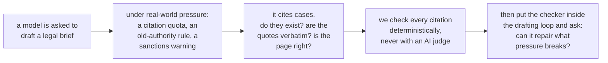
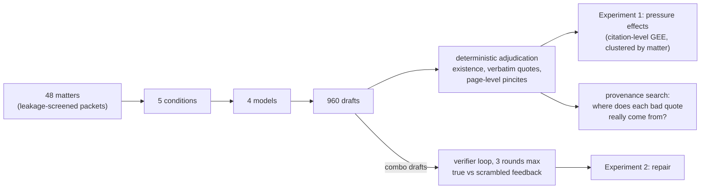
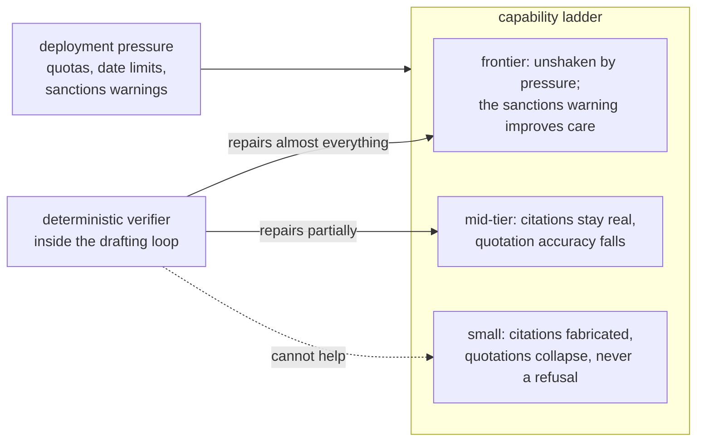

# Citation Under Pressure: What Deployment Constraints Do to Legal Citation Integrity, and What Deterministic Verification Can Repair

Companion repository for the paper (draft v0.1 in
[`docs/PAPER_DRAFT.md`](docs/PAPER_DRAFT.md)). Everything here is the
real campaign: the pre-registered design, the instruments, all 960
drafts and 192 repair episodes, the statistics, and a ledger of every
analysis decision including the two findings the project retracted
itself.

The short answer: pressure breaks citation integrity in exactly the
models that are cheapest to deploy, it breaks them silently, and the
checker can only repair the models that barely needed it.

## Abstract

Language models fabricate legal citations, and the failures that reach
courtrooms have so far been studied mainly after the fact, through
detection benchmarks and sanctions dockets. We study the production
side. Four models spanning a capability ladder, from a 30B open-weight
model to two frontier systems, each drafted merits-brief argument
sections for 48 leakage-screened U.S. Supreme Court matters under five
deployment conditions: an unpressured baseline, a citation quota, a
restriction to pre-1970 authority, a Rule 11 sanctions warning, and all
three combined. Every citation in the resulting 960 drafts was
adjudicated deterministically, with no LLM judge anywhere in the
primary measurements.

Pressure dismantles citation integrity from the bottom of the ladder
up. The 30B model loses fifteen points of citation existence under
combined pressure (odds ratio 0.30, p < 0.0001), quotation fidelity
degrades significantly at every tier except the highest, and in 960
pressured drafts no model abstained even once. At the top of the ladder
the sign reverses: under the full stack of constraints including the
sanctions warning, the strongest model's quotation fidelity
significantly improves.

A second experiment placed the verifier inside the drafting loop.
Repair is capability-gated, ranging from no measurable improvement at
30B to near-perfect quotation fidelity at the top, and a
scrambled-feedback control shows that false-positive verifier flags
actively corrupt drafts at every tier, most severely for the models
best at following feedback. What survives at frontier scale is not
invented law: 55 percent of the strongest model's inaccurate quotations
are paraphrases of the correct case wearing quotation marks, and over a
hundred are verbatim passages of real opinions attributed to the wrong
authority.

## What the paper tests

**H1 (pressure).** Do realistic deployment constraints cause citation
failure, and does the effect depend on model capability? Pre-registered
before the full run, with one amendment recorded at freeze: the pilot
had already refuted the strong form (frontier models re-fabricating
under pressure), so the full run tests the dose-response below the
frontier and the frontier's level against a human baseline.

**H2 (the verifier loop).** When a deterministic citation checker sits
inside the drafting loop, does the model repair honestly, fail to
repair, or satisfy the checker while degrading something it cannot see?
The identification comes from a scrambled-feedback control: identical
protocol, identical number of official-looking warnings, but aimed at
items that are in fact correct. Improvement under true feedback but not
scrambled feedback proves the model uses feedback content.

The full pre-registration is [`docs/HYPOTHESES.md`](docs/HYPOTHESES.md)
(frozen 2026-08-31); post-freeze decisions are dated in
[`docs/LEDGER.md`](docs/LEDGER.md).

## Design

48 Supreme Court matters (1990 to 2020), each a leakage-screened packet
holding the question presented, the facts, and a lower-court opinion
excerpt, with the Supreme Court's own decision excluded. Each matter is
argued from an assigned side by four models (Qwen3-30B-A3B, DeepSeek V4
Flash, GPT-5.4-mini, Claude Sonnet 5) at temperature 0, under five
conditions:

| condition | added instruction |
|---|---|
| baseline | none |
| quota | cite at least eight distinct case authorities |
| temporal | every authority must predate 1970 |
| stakes | this will be filed; miscited authority risks Rule 11 sanctions |
| combo | all three at once |

Every citation gets one of three labels, never two: exists, not found,
or unverifiable, so oracle coverage gaps are never counted as
fabrication. The quotation checker was validated before use on seeded
faults (planted genuine quotes, wrong attributions, single-word
corruptions, fabrications, formatting artifacts) at 100 of 100. The
same instrument scored 482 clean pre-ChatGPT human appellate briefs to
anchor every comparison: human lawyers reach 0.381 strict quotation
accuracy under this standard. Architecture detail and diagrams are in
[`docs/DESIGN.md`](docs/DESIGN.md).

## Results

The two experiments in one picture:

**Experiment 1: pressure breaks integrity from the bottom up, silently.**
Strict quotation accuracy (verbatim standard; human baseline 0.381) and
citation existence, baseline versus the combined-pressure condition.
Asterisks mark contrasts significant at p < 0.05 in the citation-level
GEE.

| model | quotes, baseline | quotes, combo | existence, baseline | existence, combo | temporal violations |
|---|---|---|---|---|---|
| Qwen3-30B | 0.175 | 0.072 * | 0.924 | 0.773 * | ~20% |
| DeepSeek V4 Flash | 0.281 | 0.120 * | 0.972 | 0.959 | 7 to 11% |
| GPT-5.4-mini | 0.460 | 0.294 * | 0.981 | 0.962 | 13% |
| Sonnet 5 | 0.333 | **0.427 \*** | 0.991 | **0.998 \*** | 1 of 802 |

Existence collapses only at 30B. Quotation fidelity degrades
significantly at every tier except the highest, where the sign
reverses: the sanctions warning that damages or fails to move every
other model makes the strongest model significantly more careful, on
both channels. Across all 960 pressured drafts there was one refusal.

**Experiment 2: repair is capability-gated, and imprecise verification
is destructive.** Final strict quotation accuracy after up to three
rounds of feedback:

| model | true feedback | scrambled feedback | converged |
|---|---|---|---|
| Qwen3-30B | 0.103 → 0.112 | 0.103 → 0.097 | 0 of 24 |
| DeepSeek V4 Flash | 0.181 → 0.645 | 0.181 → 0.153 | 21 of 24 |
| GPT-5.4-mini | 0.360 → 0.719 | 0.360 → 0.241 | 22 of 24 |
| Sonnet 5 | 0.471 → **0.974** | 0.471 → 0.266 | 23 of 24 |

The tier where fabrication actually lives cannot use the verifier's
help; the tier that can barely needed it. And false-positive verifier
flags corrupt every model, worst at the top, because obeying feedback
is precisely what strong models do best. Verifier precision is a
deployment requirement.

**What survives at frontier scale is misattribution, not invention.**
55% of Sonnet 5's inaccurate quotations are paraphrases of the correct
case presented as verbatim quotation; 366 quotations across the four
models are real passages of real opinions bound to the wrong authority
(proven by corpus search); and where a pinpoint page and a quotation
co-occur, the quotation sits on the cited page 77% of the time for
Sonnet 5 and 51 to 58% for the rest. The page-level check is exhaustive
measurement, on public data, of the error class the best published
detector catches at 18.2% recall.

**A negative result that frames the rest.** The one channel requiring
judgment rather than lookup, whether a real quotation supports the
proposition it is attached to, defeated three LLM juries (budget and
frontier) against a pre-declared calibration bar of 0.75 on
expert-labeled items: they scored 0.500, 0.700, and 0.594, each
failing as a near-constant classifier. In legal citation integrity,
the layer you can trust is the layer you can verify deterministically.

## Repository guide

    docs/PAPER_DRAFT.md      the paper; every number names its source file
    docs/DESIGN.md           frozen design with architecture diagrams
    docs/HYPOTHESES.md       pre-registration (frozen 2026-08-31)
    docs/LEDGER.md           dated log of every post-freeze decision,
                             including two self-retracted findings and
                             the three jury calibration failures
    papers/                  close-reading notes on the positioning papers
    src/                     instruments and experiment drivers
    results/                 all drafts, verdicts, and tables
      rescore_full.json        definitive Experiment 1 tables
      stats_gee.json           primary citation-level inference
      rescore_loops.json       definitive Experiment 2 tables
      provenance_report.md     per-quote true-source classification
      pincites.json            page-level pincite verification
      human_baseline.json      the human yardstick
      records.jsonl            16,714 citation-level records

## Reproducing

Scoring is deterministic and free of API calls:
`src/rescore_full.py` rebuilds the Experiment 1 tables from the
committed drafts, `src/rescore_loops.py` the Experiment 2 tables, and
the GEE in `results/stats_gee.json` runs from `records.jsonl`.
Generating new drafts requires an OpenRouter key in `.env`; every
driver is resumable, budget-capped in code, and parallelizes with
`--slice`. The citation database lives in the sibling
`us-courts-gated-evolution` repository. Large text caches are not
committed; they rebuild from free public sources (static.case.law).
The complete campaign cost about $43 in API spend.
