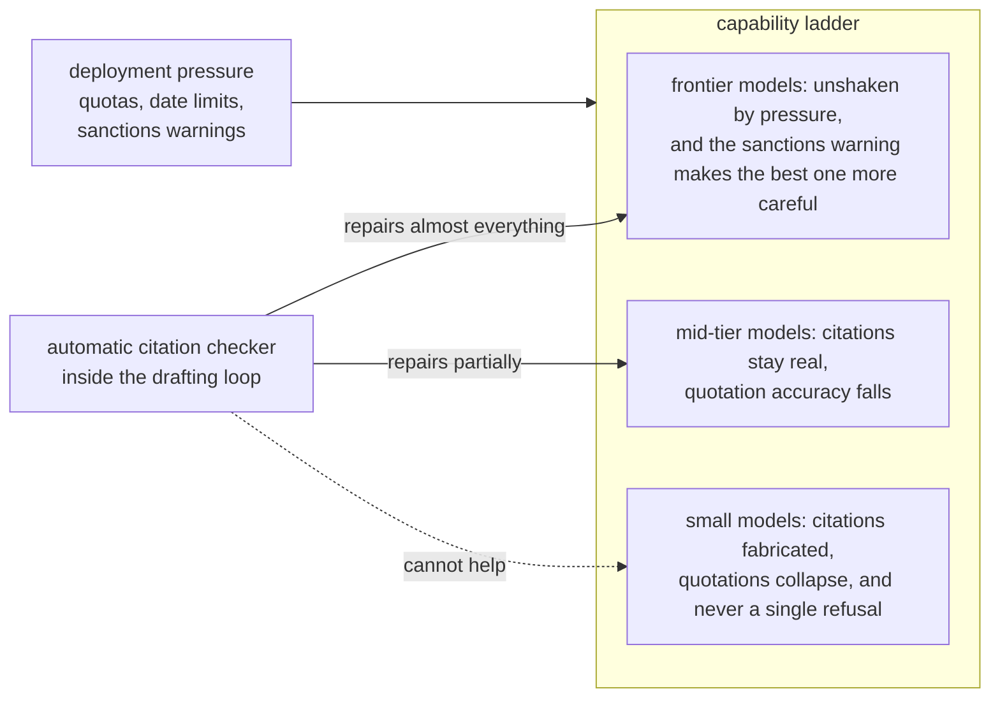

# Citation Under Pressure

Lawyers keep getting sanctioned for filing briefs with citations that an
AI invented. Almost all research on this problem works after the fact:
given a brief that already contains errors, how many can a detector
find? This project asks the question that matters before anyone files
anything. What conditions cause a model to fail at legal citation in
the first place, and does checking its citations automatically while it
drafts actually fix the problem?

To answer that, four models of very different sizes each wrote argument
sections for 48 Supreme Court cases under the pressures real users
apply: a minimum-citation quota, a rule allowing only pre-1970
authority, a warning about court sanctions, and all three at once.
Every citation in the 960 resulting drafts was then checked by
deterministic tools rather than by another AI: does the case exist,
is the quotation really verbatim, is the quoted language on the cited
page. Human lawyers' briefs were scored by the same tools to give every
number a human yardstick.

## The answer, in one picture

Pressure breaks citation integrity from the bottom of the ladder up,
and it breaks it silently. The cheap models that real products deploy
at volume are exactly the ones that fall apart, and they never once
declined the task. The automatic checker repairs drafts almost
perfectly for the strongest models and not at all for the weakest, so
verification in the loop is a luxury for the models that barely need
it. Worse, when the checker's warnings are wrong, every model damages
its own correct work trying to obey them. A verifier needs precision,
not just coverage.

What remains at the top is not invented law. More than half of the
strongest model's bad quotations are paraphrases of the right case
dressed in quotation marks, hundreds more are real passages of real
opinions credited to the wrong case, and a fifth of its pinpoint
citations point to the wrong page of the right case. The models know
the words of the law better than they know who said them.

One more result frames the whole project. The single question that
requires judgment rather than lookup, whether a real quotation actually
supports the argument it is attached to, defeated every AI jury we
tried to calibrate against expert labels, cheap panels and frontier
panels alike. In legal citation integrity, the layer you can trust is
the layer you can verify deterministically.

## Reading this repository

The paper draft is `docs/PAPER_DRAFT.md`, and every number in it names
the results file it was copied from. The experimental design, with
architecture diagrams, is `docs/DESIGN.md`; the pre-registration is
`docs/HYPOTHESES.md`; and `docs/LEDGER.md` records every analysis
decision made after the design was frozen, including two findings this
project killed with its own verification passes and reports anyway.
The instruments and drivers are in `src/`, and `results/` holds every
draft and every table.

Scoring is free and deterministic: `src/rescore_full.py` rebuilds the
main tables from the committed drafts. Drafting anew needs an
OpenRouter key in `.env`. The citation database lives in the sibling
`us-courts-gated-evolution` repository; the large text caches are not
committed because they rebuild themselves from free public sources.
The whole campaign, drafting included, cost about $43.
