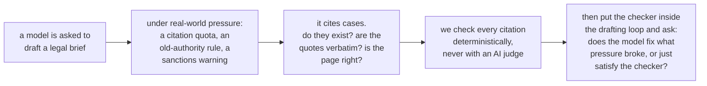
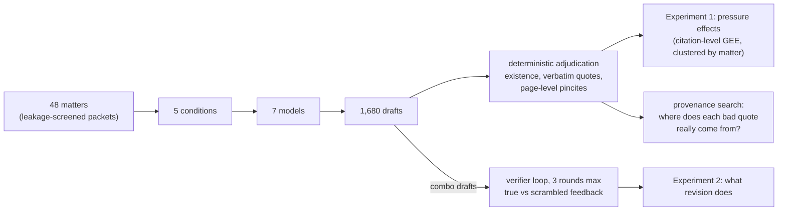
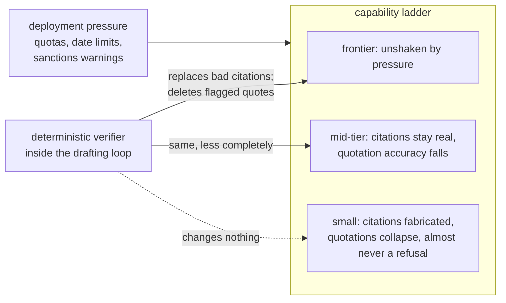

<h1 align="center">Citation Under Pressure</h1>

<h3 align="center"><em>What Deployment Constraints Do to Legal Citation Integrity, and What a Deterministic Checker Does Inside the Revision Loop</em></h3>

The short answer: pressure breaks citation integrity in the models that
are cheapest to deploy, it breaks them with almost no refusals, and when
the checker's findings are fed back, capable models satisfy it mainly
by deleting the flagged quotations rather than correcting them.

## Introduction

Courts keep sanctioning lawyers for filing briefs with citations that a
language model invented. Nearly all research on the problem works after
the fact: given a brief that already contains errors, how many can a
detector find? That is the right question for a court clerk reviewing a
filing, and the wrong one for anyone deciding whether and how to deploy
a drafting model, because it treats fabrication as a fixed property of
text rather than a behavior with causes.

This paper asks the production-side questions instead. What conditions
make a model fail at legal citation in the first place? Real users do
not prompt in the abstract; they demand a minimum number of citations,
restrict which authority is allowed, and warn about consequences. And
when a citation checker that needs no AI judgment sits inside the
drafting loop, does the model correct its work, fail to, or change the
draft so that the checker's tests pass without the quotations being
corrected?
Answering these questions took an instrument the field has said lives
only behind commercial legal databases; we built it from public data,
and it produces every primary number in the paper.

## Background: reading a legal citation

An American case citation such as *Brown v. Board of Education*, 347
U.S. 483, 495 (1954) names the parties, then the volume (347), the
reporter series (U.S., the official Supreme Court reports), and the
first page (483) where the opinion is printed. The optional second page
number (495) is the *pincite*: it points at the exact page that
supports the writer's claim. Quotations from opinions are expected to
be verbatim, and the official reporter's page boundaries, preserved in
public scans of the printed volumes, are what let a quotation be located
to its page. Rule 11 of the Federal Rules of Civil Procedure lets
district courts sanction attorneys for unwarranted filings; it is the
rule invoked in the real sanctions cases over invented AI citations,
and the one our stakes condition names (it does not govern Supreme
Court filings, which the paper says plainly). Those five terms are all
the law this repository requires.

## Abstract

Language models fabricate legal citations, and the failures that reach
courtrooms have so far been studied mainly after the fact, through
detection benchmarks and sanctions dockets. We study the production
side. Seven models spanning a capability ladder across seven vendors, from
30B open-weight to frontier, each drafted merits-brief argument
sections for 48 leakage-screened U.S. Supreme Court matters under five
deployment conditions: an unpressured baseline, a citation quota, a
restriction to pre-1970 authority, a Rule 11 sanctions warning, and all
three combined. Every citation in the resulting 1,680 drafts (1,344 of
them under some pressure) was adjudicated deterministically, with no
LLM judge anywhere in the primary measurements.

Pressure degrades citation integrity from the bottom of the ladder up.
The 30B model's citation existence falls from 0.924 to 0.773 under
combined pressure (odds ratio 0.30, corrected p < 0.001), strict
quotation accuracy falls significantly for three of the seven models
after Holm correction, and the models refused the task three times in
1,344 pressured drafts. At the top of the range (Sonnet 5, Grok 4.3,
GPT-5.4-mini) no contrast survives correction; Sonnet 5's apparent
improvement under the sanctions warning is reported as a pre-registered
null result.

A second experiment placed the checker inside the drafting loop. Under
true feedback the strongest model's strict accuracy rose from 0.471 to
0.974, and the counts show why: its scored quotations fell from 157 to
73 while its accurate quotations went from 68 to 70. The model
satisfied the checker by deleting or de-quoting the flagged passages,
and the same pattern holds for GPT-5.4-mini and DeepSeek. Nonexistent
citations, by contrast, were genuinely replaced. A scrambled-feedback
control shows that false flags lower accuracy for four of the six
models, most for the ones best at following feedback. What survives at
frontier scale is mostly real law in the wrong place: 55 percent of the
strongest model's inaccurate quotations are paraphrases of the correct
case inside quotation marks, and 620 quotations across the seven models
are verbatim passages of real opinions attributed to the wrong case (in
294 of them the true source is cited elsewhere in the same draft, so the
count is a ceiling).

## What the paper tests

**H1 (pressure).** Do realistic deployment constraints cause citation
failure, and does the effect depend on model capability? Pre-registered
before the full run, with one amendment recorded at freeze: the pilot
had already refuted the strong form (frontier models re-fabricating
under pressure), so the full run tests the dose-response below the
frontier and the frontier's level against a human baseline.

**H2 (the verifier loop).** When a deterministic citation checker sits
inside the drafting loop, does the model correct its drafts, fail to,
or satisfy the checker in a way the checker cannot detect?
The identification comes from a scrambled-feedback control: identical
protocol, identical number of official-looking warnings, but aimed at
items that are in fact correct. Improvement under true feedback but not
scrambled feedback proves the model uses feedback content.

The full pre-registration is [`docs/HYPOTHESES.md`](docs/HYPOTHESES.md)
(frozen 2026-08-31); post-freeze decisions are dated in
[`docs/LEDGER.md`](docs/LEDGER.md).

## Where this sits in prior work

| prior work | what it does | what it could not do, which we measure |
|---|---|---|
| LePhantomCite (COLM 2026) | detects injected citation errors in briefs | naturally occurring errors, elicited under realistic pressure; page-level pincite truth |
| Deployment-constraints study (arXiv:2603.07287) | pressure factorial for scholarly citations | the legal version, with deterministic rather than fuzzy verification, and formal statistics |
| LegalCiteBench (arXiv:2605.10186) | closed-book citation recall | quote fidelity anywhere; generation grounded in a verified database (our loop) |
| RLEF (arXiv:2410.02089) | execution feedback for code | the same protocol where the verifier is a legal citation oracle, plus the false-positive control |
| LLM-judge critiques (arXiv:2606.19544 among others) | show agreement overstates judge validity | a pre-declared calibration bar, and three documented failures against expert labels |

## Design

48 Supreme Court matters (1990 to 2020), each a leakage-screened packet
holding the question presented, the facts, and a lower-court opinion
excerpt, with the Supreme Court's own decision excluded. Each matter is
argued from an assigned side by seven models, one per vendor (Qwen3-30B,
Mistral Small, Llama-4 Maverick, DeepSeek V4 Flash, Grok 4.3,
GPT-5.4-mini, Claude Sonnet 5) at temperature 0, under five
conditions:

| condition | added instruction |
|---|---|
| baseline | none |
| quota | cite at least eight distinct case authorities |
| temporal | every authority must predate 1970 |
| stakes | this will be filed; miscited authority risks Rule 11 sanctions |
| combo | all three at once |

Every citation gets one of three labels, never two: exists, not found,
or unverifiable, so oracle coverage gaps are never counted as
fabrication. Inference is a citation-level logistic GEE clustered by
matter, with Holm correction over the eight contrasts within each
model. The quotation checker was validated before use on seeded
faults (planted genuine quotes, wrong attributions, single-word
corruptions, fabrications, formatting artifacts) at 100 of 100. The
same instrument scored 482 clean pre-ChatGPT human appellate briefs to
anchor every comparison: human lawyers reach 0.407 strict and 0.680
lenient quotation accuracy under this standard (578 scored quotations). Architecture detail and diagrams are in
[`docs/DESIGN.md`](docs/DESIGN.md).

## Results

The two experiments in one picture, then the numbers.

### Finding 1. Pressure breaks citation integrity from the bottom up, with almost no refusals

**Table 1.** Baseline versus the combined-pressure condition. Strict
quotation accuracy is the verbatim standard, on which human lawyers
score 0.407 (lenient rate in parentheses; humans 0.680). An asterisk
marks a contrast that is significant after Holm correction within
model.

| model | quotes: baseline | quotes: combo | citations exist: baseline | citations exist: combo | temporal violations |
|---|---|---|---|---|---|
| Qwen3-30B | 0.175 (0.564) | 0.072 (0.320) * | 0.924 | 0.773 * | 20% |
| Mistral Small | 0.207 (0.608) | 0.136 (0.383) | 0.901 | 0.868 | 35% |
| DeepSeek V4 Flash | 0.281 (0.631) | 0.120 (0.436) * | 0.972 | 0.959 | 11% |
| Grok 4.3 | 0.326 (0.644) | 0.246 (0.578) | 0.981 | 0.994 | 2 of 719 |
| Sonnet 5 | 0.333 (0.622) | 0.427 (0.642) | 0.991 | 0.998 | 1 of 803 |
| Llama-4 Maverick | 0.402 (0.618) | 0.179 (0.453) * | 0.958 | 0.939 | 10% |
| GPT-5.4-mini | 0.460 (0.722) | 0.294 (0.571) | 0.981 | 0.962 | 13% |

How to read it: rows are ordered by baseline strict accuracy; going
from the baseline column to the combo column is what pressure does.
Only the 30B model's citation existence moves. Strict quotation
accuracy falls for every model but Sonnet 5, and the fall survives
correction for Qwen, DeepSeek, and Llama. Sonnet 5's numerically higher
combo rate had an uncorrected p of 0.029 and a corrected p of 0.233, so
the paper reports it as exploratory and offers a memorization
alternative (the temporal rule shifts its citations toward older,
better-memorized cases). Compliance with the pre-1970 rule is near perfect for Sonnet 5 and
Grok 4.3 and worst for Mistral, whose other figures are second-lowest.
Across the 1,344 pressured drafts there were three refusals; an eighth
model, GLM-4.7-flash, produced no output on 33 of 240 drafts, 28 of them
under combined pressure, and is reported as a stall rather than a refusal.

### Finding 2. Capable models satisfy the checker by deleting quotations, and false flags lower accuracy

**Table 2.** Up to three rounds of checker feedback on combined-pressure
drafts, 24 matters per model. "Scored" and "accurate" are quotation
counts summed over the 24 episodes at round 0 and at the final draft;
the strict rate is their ratio. The scrambled arm receives the same
number of official-looking warnings aimed at items that are correct.

| model | scored r0 to final | accurate r0 to final | strict, true feedback | strict, scrambled | clean drafts |
|---|---|---|---|---|---|
| Qwen3-30B | 186 to 188 | 16 to 16 | 0.099 to 0.107 | 0.099 to 0.093 | 0 of 24 |
| Mistral Small | 145 to 133 | 15 to 17 | 0.208 to 0.264 | 0.208 to 0.122 | 9 of 24 |
| DeepSeek V4 Flash | 211 to 47 | 28 to 19 | 0.181 to 0.645 | 0.181 to 0.153 | 21 of 24 |
| Grok 4.3 | 61 to 10 | 15 to 10 | 0.207 to 1.000 | 0.207 to 0.208 | 24 of 24 |
| Sonnet 5 | 157 to 73 | 68 to 70 | 0.471 to 0.974 | 0.471 to 0.266 | 23 of 24 |
| Llama-4 Maverick | 64 to 29 | 11 to 8 | 0.176 to 0.349 | 0.176 to 0.188 | 21 of 24 |
| GPT-5.4-mini | 65 to 39 | 28 to 29 | 0.360 to 0.719 | 0.360 to 0.241 | 22 of 24 |

Read the strict column alone and this looks like repair rising with
capability. Read the counts and it is deletion: Sonnet 5 ended with two
more accurate quotations than it started with and 84 fewer scored ones.
Told a quotation was not verbatim, the capable models removed the
quotation or its quotation marks far more often than they corrected the
words, and the 30B model changed nothing. Citation existence was
repaired for real (citation counts flat, existence up, so nonexistent
citations were replaced). The scrambled column shows that false flags
lower accuracy for five of seven models, most for Sonnet 5 and
GPT-5.4-mini, which follow feedback best. Grok 4.3 is the purest case:
it reached 1.000 with every draft clean by correcting none of its 46
flagged quotations and removing all of them. The practical reading: use
the checker as a gate on output rather than as feedback, and measure a
probabilistic detector's false-positive rate before wiring it into a
loop. A no-feedback control arm (same rounds, no checker content) shows
that revision alone lifts Sonnet 5 only to 0.595 and GPT-5.4-mini to
0.543; true feedback adds a further 0.36 for Sonnet 5 (matter-paired,
p = 0.0003) but nothing distinguishable for GPT-5.4-mini. A
per-quotation trace (`results/loop_transitions.json`) shows the
mechanism directly: of Sonnet 5's 89 flagged quotations, 4 were
corrected, 13 lost their quotation marks, and 72 were deleted; under
false feedback it removed 56 of its 68 correct quotations. Mixed
arms in which each feedback line is true with probability 0.25, 0.5,
or 0.75 give the dose-response: Sonnet 5 removed 17, 24, 38, 53, and
56 of its 68 correct quotations as verifier precision fell from 1 to
0 (18 with no feedback at all), and its final accuracy fell 0.974,
0.855, 0.664, 0.508, 0.266 with it; a verifier right half the time
left it within seven points of no feedback, and under the lenient
verdict (near misses counted as correct) a verifier right half the
time or less leaves Sonnet 5 below revision alone. Verifier precision
is therefore a deployment requirement.

Two further accountings close the loop's books
(`results/loop_citations.json`, `results/gloop_transitions.json`).
The existence rise under true feedback is also removal: of the 113
citations that did not resolve at round 0 across the seven models, 86
were gone from the final draft and 27 remained, while 33 new resolving
citations appeared, 17 of them Mistral Small's. And because a
closed-book model cannot consult the opinion it is told it misquoted,
the true-feedback loop was rerun from the grounded combined-condition
drafts of Sonnet 5 and DeepSeek with the verbatim excerpts of the ten
retrieved authorities kept in the prompt (`src/loop_arm.py --grounded`):
of Sonnet 5's 92 flagged quotations 1 was corrected, 17 dequoted, 56
deleted, and 18 left (strict 0.496 to 0.837); DeepSeek corrected 3 of
89. The models delete in answer to a flag whether or not they hold the
source.

Three instrument checks answer the questions a reader will ask of the
strict standard and the index. Refitting every contrast on the lenient
outcome (near misses counted as correct; `src/gee.py --lenient`,
`results/stats_gee_lenient.json`), ten contrasts survive Holm within
model, the combined-condition fall among them for Qwen3-30B, DeepSeek,
and Mistral Small (Llama-4's reaches corrected p = 0.055), and Grok 4.3's
quotation accuracy rises under the stakes clause (OR 1.81, corrected
p = 0.002), a contrast absent on the strict outcome. The existence and
pinpoint checks now carry a seeded validation of their own
(`src/validate_pins.py`, `results/validate_pins.json`): on twenty seeded
U.S. Reports opinions with planted real, fabricated, and vendor
citations and a sentence pinned to its own page and to a page three or
more away, 100 of 100. And resolving the 1,766 citations that the 48
appellate deciding opinions themselves contain, real by construction
(`src/index_recall.py`, `results/index_recall.json`), the index misses 3
of 759 to F.2d, F.3d, and F. Supp. (0.4 percent) and 1 of 227 to the
U.S. Reports, so the 22 percent not-found rate the models produce on
those reporters is not coverage.

The verbatim standard was also tested against the alterations lawyers
make legitimately. The matcher already ignores case and punctuation,
splits on ellipses, and reads a bracketed alteration as its contents;
`src/alteration_aware.py` goes further and treats every bracketed
segment as an omission and drops alteration parentheticals inside the
marks, then rescores the full run (`results/records_alt.jsonl`,
`results/alteration_aware.json`, `results/stats_gee_alt.json`). Model
cells move by at most 5 points (mean 2), and the same eight contrasts
survive Holm correction. On the human reference (`src/human_alt.py`,
`results/human_alt.json`) the standard lifts lawyers from 0.407 to
0.495; of their 343 strict failures, 130 carry a bracketed alteration or
ellipsis, 94 are near misses without one (a corrupted character), and
119 are inaccurate without one.

Two robustness campaigns back the single-run table. Three independent
generations of the baseline and combined drafts on all 48 matters and
all seven models (672 drafts per run): cell-level standard deviations
are at most 0.05 for existence and 0.06 for strict accuracy, the
combined-versus-baseline quotation contrast kept its sign in every run
for every model, and pooling the three runs with a run effect the
combined fall in quotation accuracy survives Holm correction for six
of seven models (odds ratios 0.33 to 0.50), Sonnet 5 excepted. A second
prompt template for every condition on all 48 matters and all seven
models: twelve contrasts survive under it alone, and pooling both
templates with a template effect, all eight single-run survivors
survive and the combined fall survives for six of seven models (odds
ratios 0.32 to 0.46). Cell rates differ between templates by at most
11 points of strict accuracy, so single cells are template-specific
and the within-model contrasts are what the paper relies on.

A grounded arm reran the baseline and combined conditions with ten
retrieved, verified U.S. Reports authorities in the prompt (TF-IDF over
25,250 cached opinions, decided before argument, with the best-matching
passage). Models drew 51 to 83 percent of their citations from the list,
citations not found fell from 341 in 5,856 to 74 in 5,605, and the 30B
model's combined-condition existence went from 0.773 to 0.995. Quotation
accuracy rose in every combined cell, yet no cell exceeded 0.525 even
with the source passage in the prompt, and 62 percent of Sonnet 5's
remaining inaccurate quotations are paraphrase of the cited case inside
quotation marks. Retrieval nearly removes the existence failure and
leaves the residual class in place.

A second task, 48 published federal appellate decisions (four from
each of the First through Eleventh and Federal Circuits, packets built
from the deciding court's own statement of the case with the analysis
withheld and outcome sentences scrubbed), run under all five
conditions on all seven models, shows that fabrication at a neutral
prompt is more common outside the Supreme Court: baseline citation
existence is 0.65 for the 30B model, 0.72 for Mistral Small, 0.91 to
0.96 for the four models in between, and 0.99 for Sonnet 5 alone.
Twenty-two percent of citations to the federal reporters do not
resolve against four percent of citations to the U.S. Reports, and at
baseline the models cite the U.S. Reports for 37 to 58 percent of their
authorities in a circuit appeal. Within the task, Llama-4's existence
falls under the date restriction and Sonnet 5's quotation accuracy
rises under the combined condition and under the sanctions warning
alone (0.32 to 0.43), without any shift toward older cases; pooled over
both tasks, six of the eight Supreme Court survivors survive, joined by
four more falls and Sonnet 5's two rises.

### Finding 3. What survives at frontier scale is misattribution, not invention

Three residual failure modes, each measured deterministically:

| failure mode | measurement | headline number |
|---|---|---|
| paraphrase wearing quotation marks | inaccurate quotes decomposed against the cited case's own text | 55% of Sonnet 5's inaccurate quotes are paraphrases of the correct case |
| right words, wrong case | search of the 62,049 cached U.S. Reports opinions for each quote's true source (`src/provenance.py --corpus cap`) | 620 quotes across the seven models are real opinion passages bound to the wrong authority; 294 have the true source cited in the same draft; the same search finds 23 of Sonnet 5's 746 inaccurate verdicts (3.1%) to be the checker's own error |
| right case, wrong page | quote located against the official reporter's page boundaries | quote sits on the cited page 77% of the time (Sonnet 5), 42 to 64% for the rest, 89% for human briefs |

These are the errors an existence check cannot see, and the page-level
measurement covers, on public data, the error class on which published
detection agents have the lowest recall: the best published detector
misses nearly half of wrong pincites (52.8% recall), and open-weight
detectors reach 19 to 51%.

### Finding 4. The one judgment call defeated every jury

Whether a real quotation actually supports its proposition cannot be
looked up, only judged, so we tried to calibrate LLM panels against
expert-labeled misrepresentations with a pre-declared bar of 0.75:

| panel | accuracy | failure mode |
|---|---|---|
| three-family budget panel, binary verdict | 0.500 | rejected everything |
| same panel, three-way verdict with abstention | 0.700 | accepted everything |
| GPT-5.4 + Sonnet 5 + Gemini 2.5 Pro, 15K-character excerpts | 0.594 | accepted everything |

No verdict from a failed panel was interpreted; relevance is a stated
limitation of the paper.

## Repository guide

This is the companion repository for the paper (JURIX 2026 submission
in [`docs/jurix/paper.tex`](docs/jurix/paper.tex); an earlier markdown
draft is in [`docs/PAPER_DRAFT.md`](docs/PAPER_DRAFT.md)). Everything
here is the real campaign: the pre-registered design, the instruments,
all 1,680 drafts and the revision episodes, the statistics, and a
ledger of every analysis decision, including the findings the project
withdrew itself after its own verification passes.

    docs/jurix/paper.tex     the paper; every number is a macro generated
                             from the results files by src/emit_macros.py
    docs/PAPER_DRAFT.md      earlier markdown draft
    docs/DESIGN.md           frozen design with architecture diagrams
    docs/HYPOTHESES.md       pre-registration (frozen 2026-08-31)
    docs/LEDGER.md           dated log of every post-freeze decision,
                             including two self-retracted findings and
                             the three jury calibration failures
    papers/                  close-reading notes on the positioning papers
    src/                     instruments and experiment drivers
    results/                 all drafts, verdicts, and tables
      rescore_full.json        definitive Experiment 1 tables
      stats_gee.json           primary citation-level inference
      rescore_loops.json       definitive Experiment 2 tables
      loop_citations.json      existence trace and lenient rates by arm
      gloop_<model>/           grounded true-feedback loop (Sonnet 5, DeepSeek)
      provenance_report.md     per-quote true-source classification
      pincites.json            page-level pincite verification
      human_baseline.json      the human yardstick
      revision_stats.json      Holm correction, raw counts, loop counts
      records.jsonl            23,002 citation-level records

## Reproducing

Scoring is deterministic and free of API calls:
`src/rescore_full.py` rebuilds the Experiment 1 tables from the
committed drafts, `src/rescore_loops.py` the Experiment 2 tables, and
the GEE in `results/stats_gee.json` runs from `records.jsonl`.
Generating new drafts requires an OpenRouter key in `.env`; every
driver is resumable, budget-capped in code, and parallelizes with
`--slice`. The citation database lives in the sibling
`us-courts-gated-evolution` repository. Large text caches are not
committed; they rebuild from free public sources (static.case.law).
