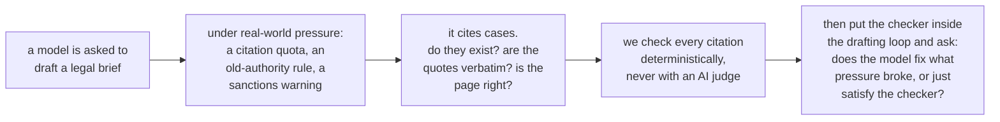
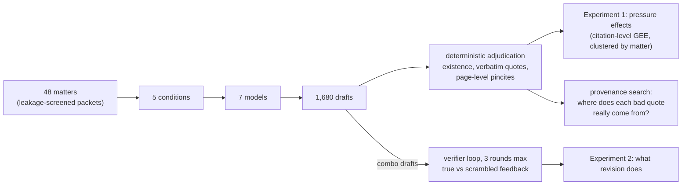
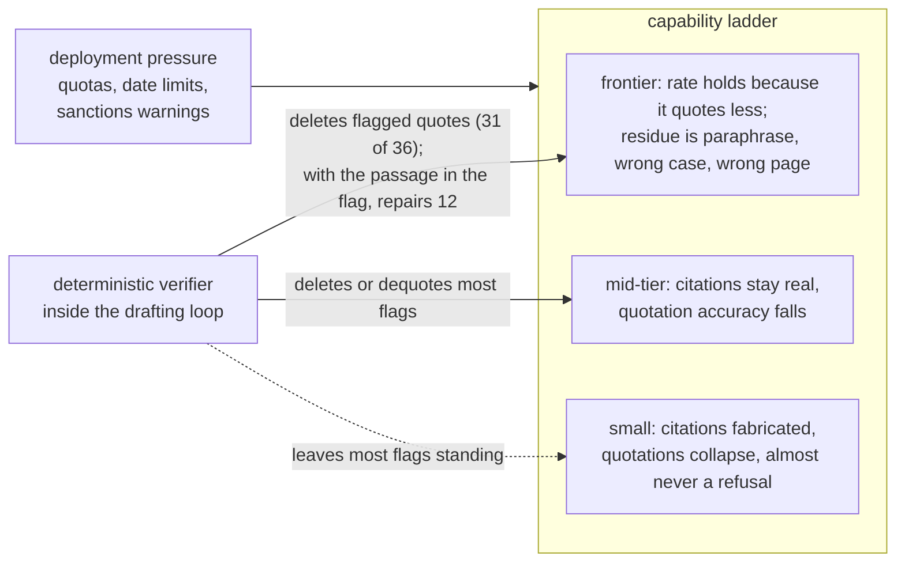

<h1 align="center">Citation Under Pressure</h1>

<h3 align="center"><em>What Deployment Constraints Do to Legal Citation Integrity, and What a Deterministic Checker Does Inside the Revision Loop</em></h3>

The short answer, in three parts. Under deployment constraints the
failure mode moves with capability: the smallest model fabricates
citations, the middle of the range misquotes, and the strongest model's
quotation rate holds only because it quotes less, while its residual
errors are paraphrase in quotation marks, real language from the wrong
case, and wrong pages. Verification is not repair: fed the checker's
findings, a capable model reaches a perfect measured score by deleting
what was flagged (Sonnet 5 repaired 3 of 36 flagged quotations and
deleted 31), and an imprecise verifier makes it delete correct
quotations too (43 of 68 under all-false flags, 20 under 50 percent
precision, 3 under a precise one). Both experiments make one point: a
model can raise an observable correctness rate by changing what it
exposes to the check, so a rate has to be read beside the count of
correct items it is computed over.

## Introduction

Courts keep sanctioning lawyers for filing briefs with citations that a
language model invented. Nearly all research on the problem works after
the fact: given a brief that already contains errors, how many can a
detector find? That is the right question for a court clerk reviewing a
filing, and the wrong one for anyone deciding whether and how to deploy
a drafting model, because it treats fabrication as a fixed property of
text rather than a behavior with causes.

This paper asks the production-side questions instead. What conditions
make a model fail at legal citation in the first place? Real users do
not prompt in the abstract; they demand a minimum number of citations,
restrict which authority is allowed, and warn about consequences. And
when a citation checker that needs no AI judgment sits inside the
drafting loop, does the model correct its work, fail to, or change the
draft so that the checker's tests pass without the quotations being
corrected?
Answering these questions took an instrument the field has said lives
only behind commercial legal databases; we built it from public data,
and it produces every primary number in the paper.

## Background: reading a legal citation

An American case citation such as *Brown v. Board of Education*, 347
U.S. 483, 495 (1954) names the parties, then the volume (347), the
reporter series (U.S., the official Supreme Court reports), and the
first page (483) where the opinion is printed. The optional second page
number (495) is the *pincite*: it points at the exact page that
supports the writer's claim. Quotations from opinions are expected to
be verbatim, and the official reporter's page boundaries, preserved in
public scans of the printed volumes, are what let a quotation be located
to its page. Rule 11 of the Federal Rules of Civil Procedure lets
district courts sanction attorneys for unwarranted filings; it is the
rule invoked in the real sanctions cases over invented AI citations,
and the one our stakes condition names (it does not govern Supreme
Court filings, which the paper says plainly). Those five terms are all
the law this repository requires.

## Abstract

Language models fabricate legal citations, and the failures that reach
courtrooms have so far been studied mainly after the fact, through
detection benchmarks and sanctions dockets. We study the production
side. Seven models spanning a capability ladder across seven vendors, from
30B open-weight to frontier, each drafted merits-brief argument
sections for 48 leakage-screened U.S. Supreme Court matters under five
deployment conditions: an unpressured baseline, a citation quota, a
restriction to pre-1970 authority, a Rule 11 sanctions warning, and all
three combined. Every citation in the resulting 1,680 drafts (1,344 of
them under some pressure) was adjudicated deterministically, with no
LLM judge anywhere in the primary measurements.

The effects are specific to the model and the constraint, and the
failure mode moves with capability. The 30B model's citation existence
falls from 0.924 to 0.773 under combined pressure (odds ratio 0.30,
corrected p < 0.001); strict quotation accuracy falls significantly for
four of the seven models after Holm correction (Qwen3-30B, DeepSeek,
Llama-4, Mistral Small) and for six of seven once three generations are
pooled; the models refused the task three times in 1,344 pressured
drafts. Sonnet 5's rate does not fall, because it quotes less under
pressure: its strict rate is numerically higher under the temporal,
stakes, and combined conditions (0.523 at baseline, 0.644 under
combined pressure, uncorrected p 0.03, corrected 0.25), but it wrote 9.6
quotations per draft at baseline and 6.1 under combined pressure, and
its accurate quotations per draft fell from 2.83 to 2.60. Its residual
errors are paraphrase presented as quotation, real language from the
wrong case, and wrong pages.

A second experiment placed the checker inside the drafting loop. Under
true feedback the strongest model's strict accuracy rose from 0.737 to
1.000, and the counts show why: its scored quotations fell from 104 to
68 while its accurate quotations stayed at 68. Of its 36 flagged
quotations it corrected 3 and deleted 31; the model satisfied the
checker by deleting or de-quoting the flagged passages, and the same
pattern holds for every model above the two smallest. Nonexistent
citations rose in existence by the same route, removal. A flag that
carries the closest passage of the cited opinion raises the corrections
fourfold, and removal still exceeds repair in every model. A
scrambled-feedback control shows that false flags lower accuracy for
five of the seven models, most for the ones best at following feedback.
What survives at frontier scale is mostly real law in the wrong place:
68 percent of the strongest model's inaccurate quotations are
paraphrases of the correct case inside quotation marks, and 326
quotations across the seven models are verbatim passages of real
opinions attributed to the wrong case (in 139 of them the true source
is cited elsewhere in the same draft, so the count is a ceiling).

## What the paper tests

**H1 (pressure).** Do realistic deployment constraints cause citation
failure, and does the effect depend on model capability? Pre-registered
before the full run, with one amendment recorded at freeze: the pilot
had already refuted the strong form (frontier models re-fabricating
under pressure), so the full run tests the dose-response below the
frontier and the frontier's level against a human baseline.

**H2 (the verifier loop).** When a deterministic citation checker sits
inside the drafting loop, does the model correct its drafts, fail to,
or satisfy the checker in a way the checker cannot detect?
The identification comes from a scrambled-feedback control: identical
protocol, identical number of official-looking warnings, but aimed at
items that are in fact correct. Improvement under true feedback but not
scrambled feedback proves the model uses feedback content.

The full pre-registration is [`docs/HYPOTHESES.md`](docs/HYPOTHESES.md)
(frozen 2026-08-31); post-freeze decisions are dated in
[`docs/LEDGER.md`](docs/LEDGER.md).

## Where this sits in prior work

| prior work | what it does | what it could not do, which we measure |
|---|---|---|
| LePhantomCite (COLM 2026) | detects injected citation errors in briefs | naturally occurring errors, elicited under realistic pressure; page-level pincite truth |
| Deployment-constraints study (arXiv:2603.07287) | pressure factorial for scholarly citations | the legal version, with deterministic rather than fuzzy verification, and formal statistics |
| LegalCiteBench (arXiv:2605.10186) | closed-book citation recall | quote fidelity anywhere; generation grounded in a verified database (our loop) |
| RLEF (arXiv:2410.02089) | execution feedback for code | the same protocol where the verifier is a legal citation oracle, plus the false-positive control |
| LLM-judge critiques (arXiv:2606.19544 among others) | show agreement overstates judge validity | a pre-declared calibration bar, and three documented failures against expert labels |

## Design

48 Supreme Court matters (1990 to 2020), each a leakage-screened packet
holding the question presented, the facts, and a lower-court opinion
excerpt, with the Supreme Court's own decision excluded. Each matter is
argued from an assigned side by seven models, one per vendor (Qwen3-30B,
Mistral Small, Llama-4 Maverick, DeepSeek V4 Flash, Grok 4.3,
GPT-5.4-mini, Claude Sonnet 5) at temperature 0, under five
conditions:

| condition | added instruction |
|---|---|
| baseline | none |
| quota | cite at least eight distinct case authorities |
| temporal | every authority must predate 1970 |
| stakes | this will be filed; miscited authority risks Rule 11 sanctions |
| combo | all three at once |

Every citation gets one of three labels, never two: exists, not found,
or unverifiable, so oracle coverage gaps are never counted as
fabrication. Inference is a citation-level logistic GEE clustered by
matter, with Holm correction over the eight contrasts within each
model. The strict quotation standard is case and punctuation
insensitive, splits a quotation on ellipses and on bracketed
alterations, so that a lawful substitution is read as an omission and
the words around it must match, and drops alteration parentheticals;
the literal matcher it replaced, which read a bracketed alteration as
its contents, is kept as the comparison (`src/alteration_aware.py`):
human lawyers score 0.493 under it, model cells move by at most 9
points (mean 3), and the same eight contrasts survive. The quotation
checker was validated before the campaign on seeded faults (planted
genuine quotes, wrong attributions, single-word corruptions,
fabrications, formatting artifacts) at 100 of 100, and again after the
audit described below at 240 of 240. The same instrument scored 482
clean pre-ChatGPT human appellate briefs to anchor every comparison:
human lawyers reach 0.594 strict and 0.776 lenient quotation accuracy
under this standard (416 scored quotations) and 0.957 citation
existence (0.976 on U.S. Reports and published federal reporters).
Federal Appendix spellings, F. App'x with a curly apostrophe and Fed.
Appx., had failed the index lookup for briefs and drafts alike until an
alias was added to the vendored checker; the index holds that reporter.
Architecture detail and diagrams are in
[`docs/DESIGN.md`](docs/DESIGN.md).

The attribution step, which decides which cited case a quotation is
tested against, was audited on real drafts and corrected on 2026-09-04.
Under the original rule a case named after a quotation could take it
from the case named before it, a quotation of a statute was bound to
the nearest case citation, and a parenthetical quotation inside a string
cite went to the next case in the string. A hand reading of 40
inaccurate verdicts drawn at random found about 20 on the checker's
side under that rule; under the corrected one a reading of 160 (the
same 40 plus a disjoint 120, `results/attribution_audit_sample.md` and
`results/attribution_audit_sample2.md`) found 35 on the checker's side,
22 percent with a 95 percent interval of 16 to 29, 111 the model's, 4
failing only on a bracketed alteration, and 10 open
(`results/attribution_sample_reading.json`). The corrected rule
attributes a quotation to the citation whose parenthetical holds it,
else the case named in its own sentence, else the citation that follows
it in that sentence, else the citation an Id. points to, else the last
citation in the paragraph; a quotation introduced by a statute, rule,
the record, or a lower court, or with no citation in its paragraph, is
left unpaired, which is 37 percent of the 10,846 quotations in the full
run. The checker-side share of the 160 varies by condition, 8 of 28 at
baseline, 11 of 30 under the quota, 6 of 33 under the temporal clause,
6 of 27 under the stakes clause, and 4 of 42 under combined pressure,
so what error remains inflates baseline and quota inaccuracy more than
combined and works against the falls the paper reports; 40 accurate
verdicts read the same way all held
(`results/attribution_audit_accurate_sample.md`). The seeded validation
(`src/validate_q2.py`) now plants twelve kinds of item per draft, six of
them attribution traps, and scores 240 of 240. The revision loop had
been run before the correction, with flags from the original rule; it
was rerun in full with the corrected checker, and the original runs are
kept as `results/loop_v1_*` and `results/gloop_v1_*`, where
`src/realized_precision.py` replays their feedback under the corrected
rule and finds the arm labelled true had realized precision 0.71 pooled
over models and 0.38 for Sonnet 5. Every number in this README and the
paper is from the corrected rule and the rerun loop.

## Results

The two experiments in one picture, then the numbers.

### Finding 1. The failure mode moves with capability, and the strongest model's rate holds because it quotes less

**Table 1.** Baseline versus the combined-pressure condition. Strict
quotation accuracy is the alteration-aware verbatim standard, over
attributed quotations only, on which human lawyers score 0.594 (lenient
rate in parentheses; humans 0.776), with the scored quotations in
brackets; existence cells carry citations not found over adjudicable
citations. An asterisk marks a contrast that is significant after Holm
correction within model.

| model | quotes: baseline | quotes: combo | citations exist: baseline | citations exist: combo | temporal violations (temporal condition) |
|---|---|---|---|---|---|
| Qwen3-30B | 0.165 (0.609) [230] | 0.061 (0.320) [325] * | 0.924 [28/370] | 0.773 [90/397] * | 20% (60 of 307) |
| Mistral Small | 0.262 (0.620) [187] | 0.157 (0.444) [248] | 0.901 [37/373] | 0.868 [69/521] | 35% (141 of 401) |
| DeepSeek V4 Flash | 0.381 (0.730) [252] | 0.142 (0.491) [281] * | 0.972 [10/354] | 0.959 [20/488] | 11% (40 of 356) |
| Grok 4.3 | 0.455 (0.737) [156] | 0.302 (0.647) [119] | 0.981 [5/257] | 0.994 [3/479] | 0 of 240 |
| Sonnet 5 | 0.523 (0.804) [260] | 0.644 (0.825) [194] | 0.991 [3/318] | 0.998 [1/450] | 0 of 353 |
| GPT-5.4-mini | 0.583 (0.819) [127] | 0.466 (0.693) [88] | 0.981 [8/417] | 0.962 [27/713] | 13% (68 of 519) |
| Llama-4 Maverick | 0.588 (0.784) [51] | 0.230 (0.557) [61] * | 0.958 [9/213] | 0.939 [31/506] | 10% (22 of 213) |

How to read it: going from the baseline column to the combo column is
what pressure does. Only the 30B model's citation existence moves, and
each of its surviving existence contrasts rests on at least 28
citations not found per arm; a record is one occurrence of a full
citation, short forms are not counted, and refitting on distinct
authorities per draft (`src/gee.py --distinct`) leaves the same eight
contrasts surviving. Strict quotation accuracy falls for every model but
Sonnet 5, and the fall survives correction for Llama-4 under the
temporal and combined conditions, for Qwen and DeepSeek under the
combined condition, and for Mistral Small under the temporal clause.
Scored quotations per cell run from 42 to 325 and the unpaired share
from 15 to 50 percent, so the rates are conditional on quoting, which
is the point Sonnet 5's contrast turns on: its combo rate is
numerically higher (uncorrected p 0.031, corrected 0.250), but it wrote
9.6 quotations per draft at baseline and 6.1 under combined pressure
and its accurate quotations per draft fell from 2.83 to 2.60, so the
rise is selection, fewer and safer quotations; the temporal rule also
shifts its citations toward older, better-memorized cases (median
decision year 1943 against 1986).

Compliance with the pre-1970 rule is perfect for Sonnet 5 and Grok 4.3
and worst for Mistral, whose other figures are second-lowest.
Across the 1,344 pressured drafts there were three refusals; an eighth
model, GLM-4.7-flash, produced no output on 33 of 240 drafts, 28 of them
under combined pressure, and is reported as a stall rather than a refusal.

### Finding 2. Capable models satisfy the checker by deleting quotations, and false flags lower accuracy

**Table 2.** Up to three rounds of checker feedback on combined-pressure
drafts, 24 matters per model, rerun with the corrected checker.
"Scored" and "accurate" are quotation counts summed over the 24
episodes at round 0 and at the final draft; the strict rate is the mean
over drafts with a quotation left to score. The scrambled arm receives
the same number of official-looking warnings aimed at items that are
correct. Clean episodes are split into those that ended on a passing
draft with quotations and those that ended on a draft emptied of them.

| model | scored r0 to final | accurate r0 to final | strict, true feedback | strict, scrambled | clean drafts (with quotations, by deletion) |
|---|---|---|---|---|---|
| Qwen3-30B | 150 to 159 | 12 to 12 | 0.089 to 0.092 | 0.089 to 0.121 | 0 of 24 |
| Mistral Small | 109 to 89 | 13 to 17 | 0.233 to 0.350 | 0.233 to 0.116 | 10 of 24 (3, 7) |
| DeepSeek V4 Flash | 165 to 34 | 29 to 28 | 0.292 to 0.950 | 0.292 to 0.225 | 23 of 24 (11, 12) |
| Grok 4.3 | 50 to 10 | 13 to 10 | 0.234 to 1.000 | 0.234 to 0.275 | 24 of 24 (5, 19) |
| Sonnet 5 | 104 to 68 | 68 to 68 | 0.737 to 1.000 | 0.737 to 0.575 | 24 of 24 (23, 1) |
| Llama-4 Maverick | 44 to 9 | 11 to 9 | 0.273 to 1.000 | 0.273 to 0.111 | 24 of 24 (6, 18) |
| GPT-5.4-mini | 53 to 29 | 31 to 27 | 0.538 to 0.857 | 0.538 to 0.536 | 20 of 24 (11, 9) |

Read the strict column alone and this looks like repair rising with
capability. Read the counts and it is deletion: Sonnet 5 ended with the
same 68 accurate quotations it started with and 36 fewer scored ones,
and 68 of the 168 true-feedback episodes ended with nothing left to
score, 19 of Grok 4.3's 24, so its final 1.000 rests on five drafts.
Told a quotation was not verbatim, every model but Qwen3-30B and
Mistral Small, which left most flags standing, removed the quotation or
its quotation marks far more often than it corrected the words. The
scrambled column shows that false flags lower accuracy for five of
seven models, most for Sonnet 5 and Llama-4. Grok 4.3 is the purest
case: every one of its 24 episodes ended clean, and of its 37 flagged
quotations it corrected none, dequoted 23, and deleted 14. The
practical reading: use the checker as a gate on output rather than as
bare feedback, and measure a probabilistic detector's false-positive
rate before wiring it into a loop. A no-feedback control arm (same
rounds, no checker content) shows that revision alone lifts Sonnet 5
only to 0.787 and GPT-5.4-mini to 0.714; true feedback adds a further
0.21 for Sonnet 5 (matter-paired over matters scored in both arms,
interval 0.12 to 0.32, p 0.002) and 0.38 for DeepSeek (0.20 to 0.58,
p 0.012), while GPT-5.4-mini's, Qwen3-30B's, and Mistral Small's
differences (0.04, 0.02, 0.05) are within noise and Llama-4 and Grok
4.3 left too few paired matters to test. A per-quotation trace
(`results/loop_transitions.json`) shows the mechanism directly: of
Sonnet 5's 36 flagged quotations, 1 was corrected in place and 2
replaced by a new accurate quotation from the same case, 2 lost their
quotation marks, 31 were deleted, and none was left; only 3 of its 68
accurate quotations went, against 21 under revision with no feedback,
so precise flags made it more careful with correct material, and under
false feedback it removed 43 of the 68. Mixed arms in which each
feedback line is true with probability 0.25, 0.5, or 0.75 give the
dose-response: Sonnet 5 removed 3, 8, 20, 27, and 43 of its 68 correct
quotations as verifier precision fell from 1 to 0 (21 with no feedback
at all), and its final accuracy fell 1.000, 1.000, 0.956, 0.830, 0.575
with it; a verifier with 50 percent precision removed 20 correct
quotations against 3 under a precise one, and under the lenient verdict
(near misses counted as correct) only all-false feedback leaves Sonnet
5 below revision alone (0.861 against 0.880). Verifier precision is
therefore a deployment requirement.

Two further accountings close the loop's books
(`results/loop_citations.json`, `results/gloop_transitions.json`).
The existence rise under true feedback is also removal: of the 113
citations that did not resolve at round 0 across the seven models, 82
were gone from the final draft and 31 remained, while 37 new resolving
citations appeared, 17 of them Mistral Small's. And because a
closed-book model cannot consult the opinion it is told it misquoted,
the true-feedback loop was rerun from the grounded combined-condition
drafts of Sonnet 5 and DeepSeek with the verbatim excerpts of the ten
retrieved authorities kept in the prompt (`src/loop_arm.py --grounded`):
repair (in place or by a replacement quotation on the same citation)
stayed at 4 of Sonnet 5's 23 flags and 1 of DeepSeek's 51, against 3 of
36 and 2 of 136 closed-book, with removal still the majority response.
A passage arm then put the evidence in the flag itself: each quotation
line carried the closest passage of the cited opinion, found by the same
window search the retrieval arm uses (`--arms passage`). Repair rose in
six of seven models (Grok 4.3 still repaired none): to 12 of 36 for
Sonnet 5 (3 in place, 9 replaced by the supplied passage) against 23
deleted or dequoted, to 26 of 96 for Mistral Small against 4 under bare
flags, to 24 of 138 for Qwen3-30B against none, and to 12 of 136 for
DeepSeek, which still removed 124; almost all of it by replacement, and
removal exceeded repair in every model. Final strict rates under the
passage arm were 0.993 for Sonnet 5 and 1.000 for DeepSeek over more
surviving quotations (83 scored against 68 for Sonnet 5). A loop should
hand the model the passage; even then it removes more than it repairs.

Three instrument checks answer the questions a reader will ask of the
strict standard and the index. Refitting every contrast on the lenient
outcome (near misses counted as correct; `src/gee.py --lenient`,
`results/stats_gee_lenient.json`), eight contrasts survive Holm within
model, the combined-condition fall among them for Qwen3-30B, DeepSeek,
and Mistral Small (Llama-4's reaches corrected p = 0.077). The existence and
pinpoint checks now carry a seeded validation of their own
(`src/validate_pins.py`, `results/validate_pins.json`): on twenty seeded
U.S. Reports opinions with planted real, fabricated, and vendor
citations and a sentence pinned to its own page and to a page three or
more away, 100 of 100. And resolving the 1,766 citations that the 48
appellate deciding opinions themselves contain, real by construction
(`src/index_recall.py`, `results/index_recall.json`), the index misses 3
of 759 to F.2d, F.3d, and F. Supp. (0.4 percent) and 1 of 227 to the
U.S. Reports, so the 22 percent not-found rate the models produce on
those reporters is not coverage.

Two further checks sit in Section 3 and Section 4 of the paper. Existence means the volume, reporter, and page resolve to an indexed opinion; the case name is compared separately (`src/name_mismatch.py`), and 205 of 11,769 resolving citations (1.7 percent) carry a name the index does not match, a ceiling that includes abbreviated names, so the cells near 1.00 do not rest on wrong pages landing on real opinions. And the temporal fall is not an artifact of scanned text: within the baseline condition alone, strict accuracy for quotations from opinions decided before 1970 is 0.439 against 0.383 for later ones (`src/era_check.py`).

The strict standard reads every bracketed segment as an omission and
drops alteration parentheticals inside the marks, so the alterations
lawyers make legitimately pass. The literal matcher it replaced, which
read a bracketed alteration as its contents, is kept as the comparison:
`src/alteration_aware.py` rescores the full run under it
(`results/records_alt.jsonl`, `results/alteration_aware.json`,
`results/stats_gee_alt.json`), model cells move by at most 9 points
(mean 3), and the same eight contrasts survive Holm correction. On the
human reference (`src/human_alt.py`, `results/human_alt.json`) the
literal matcher puts lawyers at 0.493 against 0.594 under the strict
standard; of the 169 human strict failures that remain, 43 still carry
a bracket or an ellipsis, 59 are near misses without any alteration (a
corrupted character), and 67 are inaccurate without one.

Two robustness campaigns back the single-run table. Three independent
generations of the baseline and combined drafts on all 48 matters and
all seven models (672 drafts per run): cell-level standard deviations
are at most 0.050 for existence and 0.057 for strict accuracy, the
combined-versus-baseline quotation contrast kept its sign in every run
for every model, and pooling the three runs with a run effect the
combined fall in quotation accuracy survives Holm correction for six
of seven models (odds ratios 0.20 to 0.53), Sonnet 5 excepted. A second
prompt template for every condition on all 48 matters and all seven
models: twelve contrasts survive under it alone, five of them among the
eight single-run survivors, and pooling both templates with a template
effect, all eight single-run survivors survive and the combined fall
survives for six of seven models (odds ratios 0.27 to 0.46), Sonnet 5
again excepted. Cell rates differ between templates by at most 15
points of strict accuracy and 19 of existence, more than many single-run
condition effects, so single cells are template-specific and the
within-model contrasts that survive across runs and templates are what
the paper relies on.

A grounded arm reran the baseline and combined conditions with ten
retrieved, verified U.S. Reports authorities in the prompt (TF-IDF over
25,250 cached opinions, decided before argument, with the best-matching
passage). Models drew 51 to 83 percent of their citations from the list,
citations not found fell from 341 in 5,856 to 74 in 5,605, and the 30B
model's combined-condition existence went from 0.773 to 0.995. Quotation
accuracy rose in every cell, yet no cell exceeded 0.734 even
with the source passage in the prompt, and 61 percent of Sonnet 5's 71
remaining inaccurate quotations are paraphrase of the cited case inside
quotation marks. Retrieval nearly removes the existence failure and
leaves the residual class in place.

A second task, 48 published federal appellate decisions (four from
each of the First through Eleventh and Federal Circuits, packets built
from the deciding court's own statement of the case with the analysis
withheld and outcome sentences scrubbed), run under all five
conditions on all seven models, shows that fabrication at a neutral
prompt is more common outside the Supreme Court: baseline citation
existence is 0.65 for the 30B model, 0.73 for Mistral Small, 0.91 to
0.96 for the four models in between, and 0.99 for Sonnet 5 alone.
Twenty-two percent of citations to the federal reporters do not
resolve against four percent of citations to the U.S. Reports (the
index misses 0.4 percent of the federal-reporter citations in the
deciding opinions themselves, so the gap is not coverage), and at
baseline the models cite the U.S. Reports for 37 to 58 percent of their
authorities in a circuit appeal. Within the task, one pressure contrast survives correction, Llama-4's
existence fall under the date restriction (0.950 to 0.857, odds ratio
0.32, corrected p 0.018); Sonnet 5's quotation rate rises under the
sanctions warning alone (0.480 to 0.620, odds ratio 1.75, corrected p
0.084), without any shift toward older cases, and that rise survives
only the pooled-task fit (odds ratio 1.53, corrected p 0.020). Pooled
over both tasks, seven of the eight Supreme Court survivors survive
(Qwen3-30B's quota existence fall drops out), joined by Llama-4's
existence falls under the temporal and combined clauses, DeepSeek's
temporal and Mistral Small's combined quotation falls, and Sonnet 5's
rate rise under the sanctions warning.

### Finding 3. What survives at frontier scale is misattribution, not invention

Three residual failure modes, each measured deterministically:

| failure mode | measurement | headline number |
|---|---|---|
| paraphrase wearing quotation marks | inaccurate quotes decomposed against the cited case's own text | 68% of Sonnet 5's 250 inaccurate quotes (169) are paraphrases of the correct case; 56 match nothing in it and 25 cite authority outside the U.S. Reports |
| right words, wrong case | search of the 62,049 cached U.S. Reports opinions for each quote's true source (`src/provenance.py --corpus cap`) | 326 quotes across the seven models (72 of Sonnet 5's) are real opinion passages bound to the wrong authority; 139 have the true source cited in the same draft; the same search finds 5 of Sonnet 5's 250 inaccurate verdicts (2.0%) to be the checker's own error, and a hand reading of 160 inaccurate verdicts finds 35 on the checker's side (22 percent, interval 16 to 29) |
| right case, wrong page | quote located against the official reporter's page boundaries | quote sits on the cited page 83% of the time (Sonnet 5), 50 to 67% for the rest, 88% for human briefs; 12% of the rest sit on an adjacent page |

These are the errors an existence check cannot see, and the page-level
measurement covers, on public data, the error class on which published
detection agents have the lowest recall: the best published detector
misses nearly half of wrong pincites (52.8% recall), and open-weight
detectors reach 19 to 51%.

### Finding 4. The one judgment call defeated every jury

Whether a real quotation actually supports its proposition cannot be
looked up, only judged, so we tried to calibrate LLM panels against
expert-labeled misrepresentations with a pre-declared bar of 0.75:

| panel | accuracy | failure mode |
|---|---|---|
| three-family budget panel, binary verdict | 0.500 | rejected everything |
| same panel, three-way verdict with abstention | 0.700 | accepted everything |
| GPT-5.4 + Sonnet 5 + Gemini 2.5 Pro, 15K-character excerpts | 0.594 | accepted everything |

No verdict from a failed panel was interpreted; relevance is a stated
limitation of the paper.

## Repository guide

This is the companion repository for the paper (JURIX 2026 submission
in [`docs/jurix/paper.tex`](docs/jurix/paper.tex); an earlier markdown
draft is in [`docs/PAPER_DRAFT.md`](docs/PAPER_DRAFT.md)). Everything
here is the real campaign: the pre-registered design, the instruments,
all 1,680 drafts and the revision episodes, the statistics, and a
ledger of every analysis decision, including the findings the project
withdrew itself after its own verification passes.

    docs/jurix/paper.tex     the paper; every number is a macro generated
                             from the results files by src/emit_macros.py
    docs/PAPER_DRAFT.md      earlier markdown draft
    docs/DESIGN.md           frozen design with architecture diagrams
    docs/HYPOTHESES.md       pre-registration (frozen 2026-08-31)
    docs/figures/            the paper's two figures and the two README
                             figures above (src/figures.py, src/figures_readme.py)
    docs/LEDGER.md           dated log of every post-freeze decision,
                             including two self-retracted findings and
                             the three jury calibration failures
    papers/                  close-reading notes on the positioning papers
    src/                     instruments and experiment drivers
    results/                 all drafts, verdicts, and tables
      rescore_full.json        definitive Experiment 1 tables
      stats_gee.json           primary citation-level inference
      rescore_loops.json       definitive Experiment 2 tables
      loop_citations.json      existence trace and lenient rates by arm
      gloop_<model>/           grounded true-feedback loop (Sonnet 5, DeepSeek)
      loop_v1_<model>/         the loop as first run, under the original attribution rule
      realized_precision.json  that run's feedback replayed under the corrected rule
      alteration_aware.json    the literal matcher against the strict standard
      stats_gee_distinct.json  the primary fit on distinct authorities per draft
      provenance_report_cap.md per-quote true-source classification
      attribution_audit.json   audit of every inaccurate verdict on real drafts
      validate_q2.log          seeded validation of the quotation checker, 240 of 240
      pincites.json            page-level pincite verification
      human_baseline.json      the human yardstick
      revision_stats.json      Holm correction, raw counts, loop counts
      records.jsonl            24,886 citation-level records

## Reproducing

The repository stands alone. The checker (`src/checker/`, with
`build_index.py` for the citation index), the request runtime
(`src/runtime/`), the packet prompts (`src/sim/`), the 48 Supreme Court
packets (`data/packets/`), and the appellate packets (`results/appellate/`)
are all here. Two things are not committed because of size and rebuild
from public sources: the 18-million-row citation index `checker.db`,
built by `src/checker/build_index.py` from the CourtListener bulk
citation and cluster exports (set `CUP_CHECKER_DB` to its path), and the
Caselaw Access Project text cache `data/cap_text_cache.sqlite`, which
`src/local_text.py` fills from static.case.law on first use. The original
attribution rule the audit replaced is kept as
`src/legacy/quotecheck2_original.py`, and the loop runs made under it as
`results/loop_v1_*` and `results/gloop_v1_*`; `src/realized_precision.py`
replays their feedback under the corrected rule.

Scoring is deterministic and free of API calls:
`src/rescore_full.py` rebuilds the Experiment 1 tables from the
committed drafts, `src/rescore_loops.py` the Experiment 2 tables, and
the GEE in `results/stats_gee.json` runs from `records.jsonl`.
Generating new drafts requires an OpenRouter key in `.env`; every
driver is resumable, budget-capped in code, and parallelizes with
`--slice`. Large text caches are not committed; they rebuild from free public
sources (static.case.law).
