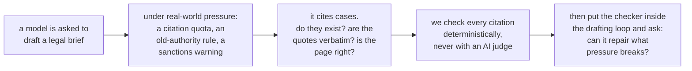
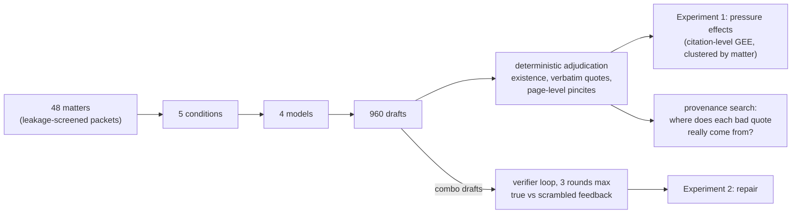
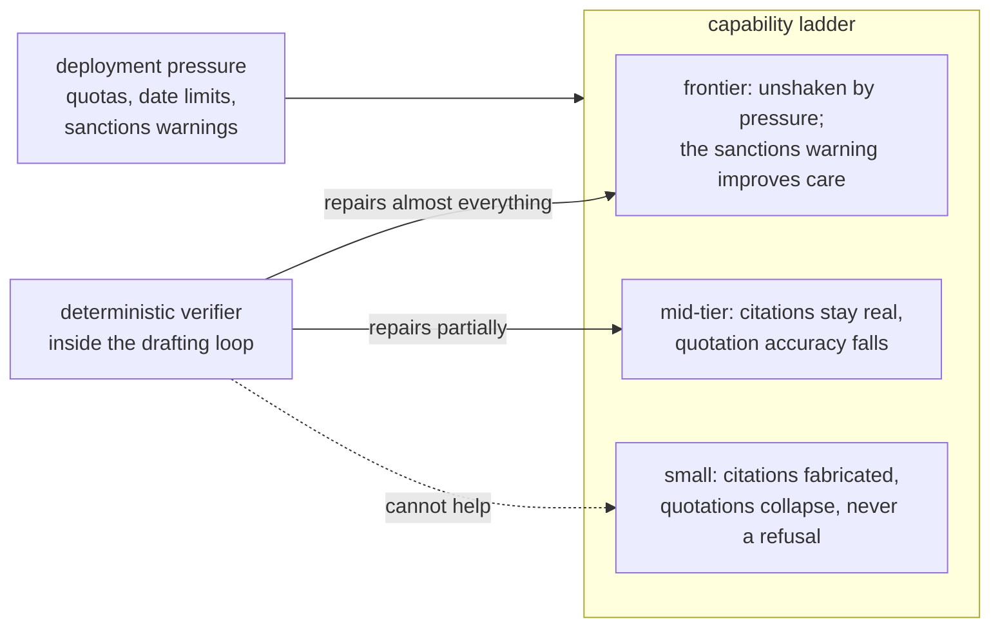

<h1 align="center">Citation Under Pressure</h1>

<h3 align="center"><em>What Deployment Constraints Do to Legal Citation Integrity, and What Deterministic Verification Can Repair</em></h3>

The short answer: pressure breaks citation integrity in exactly the
models that are cheapest to deploy, it breaks them silently, and the
checker can only repair the models that barely needed it.

## Introduction

Courts keep sanctioning lawyers for filing briefs with citations that a
language model invented. Nearly all research on the problem works after
the fact: given a brief that already contains errors, how many can a
detector find? That is the right question for a court clerk reviewing a
filing, and the wrong one for anyone deciding whether and how to deploy
a drafting model, because it treats fabrication as a fixed property of
text rather than a behavior with causes.

This paper asks the production-side questions instead. What conditions
make a model fail at legal citation in the first place? Real users do
not prompt in the abstract; they demand a minimum number of citations,
restrict which authority is allowed, and warn about consequences. And
when a citation checker that needs no AI judgment sits inside the
drafting loop, does the model repair its work honestly, fail to, or
learn to satisfy the checker while degrading something it cannot see?
Answering these questions took an instrument the field has said lives
only behind commercial legal databases; we built it from public data,
and it produces every primary number in the paper.

## Abstract

Language models fabricate legal citations, and the failures that reach
courtrooms have so far been studied mainly after the fact, through
detection benchmarks and sanctions dockets. We study the production
side. Four models spanning a capability ladder, from a 30B open-weight
model to two frontier systems, each drafted merits-brief argument
sections for 48 leakage-screened U.S. Supreme Court matters under five
deployment conditions: an unpressured baseline, a citation quota, a
restriction to pre-1970 authority, a Rule 11 sanctions warning, and all
three combined. Every citation in the resulting 960 drafts was
adjudicated deterministically, with no LLM judge anywhere in the
primary measurements.

Pressure dismantles citation integrity from the bottom of the ladder
up. The 30B model loses fifteen points of citation existence under
combined pressure (odds ratio 0.30, p < 0.0001), quotation fidelity
degrades significantly at every tier except the highest, and in 960
pressured drafts no model abstained even once. At the top of the ladder
the sign reverses: under the full stack of constraints including the
sanctions warning, the strongest model's quotation fidelity
significantly improves.

A second experiment placed the verifier inside the drafting loop.
Repair is capability-gated, ranging from no measurable improvement at
30B to near-perfect quotation fidelity at the top, and a
scrambled-feedback control shows that false-positive verifier flags
actively corrupt drafts at every tier, most severely for the models
best at following feedback. What survives at frontier scale is not
invented law: 55 percent of the strongest model's inaccurate quotations
are paraphrases of the correct case wearing quotation marks, and over a
hundred are verbatim passages of real opinions attributed to the wrong
authority.

## What the paper tests

**H1 (pressure).** Do realistic deployment constraints cause citation
failure, and does the effect depend on model capability? Pre-registered
before the full run, with one amendment recorded at freeze: the pilot
had already refuted the strong form (frontier models re-fabricating
under pressure), so the full run tests the dose-response below the
frontier and the frontier's level against a human baseline.

**H2 (the verifier loop).** When a deterministic citation checker sits
inside the drafting loop, does the model repair honestly, fail to
repair, or satisfy the checker while degrading something it cannot see?
The identification comes from a scrambled-feedback control: identical
protocol, identical number of official-looking warnings, but aimed at
items that are in fact correct. Improvement under true feedback but not
scrambled feedback proves the model uses feedback content.

The full pre-registration is [`docs/HYPOTHESES.md`](docs/HYPOTHESES.md)
(frozen 2026-08-31); post-freeze decisions are dated in
[`docs/LEDGER.md`](docs/LEDGER.md).

## Design

48 Supreme Court matters (1990 to 2020), each a leakage-screened packet
holding the question presented, the facts, and a lower-court opinion
excerpt, with the Supreme Court's own decision excluded. Each matter is
argued from an assigned side by four models (Qwen3-30B-A3B, DeepSeek V4
Flash, GPT-5.4-mini, Claude Sonnet 5) at temperature 0, under five
conditions:

| condition | added instruction |
|---|---|
| baseline | none |
| quota | cite at least eight distinct case authorities |
| temporal | every authority must predate 1970 |
| stakes | this will be filed; miscited authority risks Rule 11 sanctions |
| combo | all three at once |

Every citation gets one of three labels, never two: exists, not found,
or unverifiable, so oracle coverage gaps are never counted as
fabrication. The quotation checker was validated before use on seeded
faults (planted genuine quotes, wrong attributions, single-word
corruptions, fabrications, formatting artifacts) at 100 of 100. The
same instrument scored 482 clean pre-ChatGPT human appellate briefs to
anchor every comparison: human lawyers reach 0.407 strict quotation
accuracy under this standard (578 scored quotations). Architecture detail and diagrams are in
[`docs/DESIGN.md`](docs/DESIGN.md).

## Results

The two experiments in one picture, then the numbers.

### Finding 1. Pressure breaks citation integrity from the bottom up, and it breaks it silently

**Table 1.** Baseline versus the combined-pressure condition. Strict
quotation accuracy is the verbatim standard, on which human lawyers
score 0.407. An asterisk marks a contrast whose citation-level GEE
p-value is below 0.05.

| model | quotes: baseline | quotes: combo | citations exist: baseline | citations exist: combo | temporal violations |
|---|---|---|---|---|---|
| Qwen3-30B | 0.175 | 0.072 * | 0.924 | 0.773 * | ~20% |
| DeepSeek V4 Flash | 0.281 | 0.120 * | 0.972 | 0.959 | 7 to 11% |
| GPT-5.4-mini | 0.460 | 0.294 * | 0.981 | 0.962 | 13% |
| Sonnet 5 | 0.333 | **0.427 \*** | 0.991 | **0.998 \*** | 1 of 802 |

How to read it: going down a column is the capability ladder; going
from the baseline column to the combo column is what pressure does.
Fabricated citations appear only in the top row. Quotation accuracy
falls significantly in every row except the last, where it
significantly *rises*: the sanctions warning that damages or fails to
move every other model makes the strongest one more careful. Compliance
with the pre-1970 rule follows the same ladder, from one violation in
five down to one in eight hundred. And across all 960 pressured drafts
there was exactly one refusal; every other degradation happened
without a word of warning.

### Finding 2. The verifier repairs only the models that least need it, and false warnings poison every model

**Table 2.** Strict quotation accuracy before and after up to three
rounds of verifier feedback on combined-pressure drafts. The scrambled
arm receives the same number of official-looking warnings aimed at
items that are actually correct.

| model | true feedback | scrambled feedback | converged |
|---|---|---|---|
| Qwen3-30B | 0.103 → 0.112 | 0.103 → 0.097 | 0 of 24 |
| DeepSeek V4 Flash | 0.181 → 0.645 | 0.181 → 0.153 | 21 of 24 |
| GPT-5.4-mini | 0.360 → 0.719 | 0.360 → 0.241 | 22 of 24 |
| Sonnet 5 | 0.471 → **0.974** | 0.471 → 0.266 | 23 of 24 |

Two lessons sit in this table. Repair ability rises with capability,
which means the tier where fabrication actually lives (row one) cannot
use the verifier's help, while the tier that repairs almost perfectly
barely needed it. And the scrambled column shows that false-positive
verifier flags are not harmless noise: every model damages its own
correct work trying to obey them, and the strongest models, being the
best at obeying, are damaged most. A verifier in the loop needs
precision guarantees, not just coverage.

### Finding 3. What survives at frontier scale is misattribution, not invention

Three residual failure modes, each measured deterministically:

| failure mode | measurement | headline number |
|---|---|---|
| paraphrase wearing quotation marks | inaccurate quotes decomposed against the cited case's own text | 55% of Sonnet 5's inaccurate quotes are paraphrases of the correct case |
| right words, wrong case | corpus search for each quote's true source | 366 quotes across models are real opinion passages bound to the wrong authority |
| right case, wrong page | quote located against star pagination | quote sits on the cited page 77% of the time (Sonnet 5), 51 to 58% for the rest |

The models know the words of the law better than they know who said
them or where. These are exactly the errors invisible to an existence
check and to any reader who recognizes the language, and the page-level
measurement is exhaustive on public data for the error class detection
agents handle worst: the best published detector misses nearly half of
wrong pincites (52.8% recall), and every open-weight detector misses
roughly three quarters.

### Finding 4. The one judgment call defeated every jury

Whether a real quotation actually supports its proposition cannot be
looked up, only judged, so we tried to calibrate LLM panels against
expert-labeled misrepresentations with a pre-declared bar of 0.75:

| panel | accuracy | failure mode |
|---|---|---|
| three-family budget panel, binary verdict | 0.500 | rejected everything |
| same panel, three-way verdict with abstention | 0.700 | accepted everything |
| GPT-5.4 + Sonnet 5 + Gemini 2.5 Pro, 15K-character excerpts | 0.594 | accepted everything |

No verdict from a failed panel was interpreted. The result frames the
whole project: in legal citation integrity, the layer you can trust is
the layer you can verify deterministically.

## Repository guide

This is the companion repository for the paper (draft v0.1 in
[`docs/PAPER_DRAFT.md`](docs/PAPER_DRAFT.md)). Everything here is the
real campaign: the pre-registered design, the instruments, all 960
drafts and 192 repair episodes, the statistics, and a ledger of every
analysis decision, including the two findings the project retracted
itself.

    docs/PAPER_DRAFT.md      the paper; every number names its source file
    docs/DESIGN.md           frozen design with architecture diagrams
    docs/HYPOTHESES.md       pre-registration (frozen 2026-08-31)
    docs/LEDGER.md           dated log of every post-freeze decision,
                             including two self-retracted findings and
                             the three jury calibration failures
    papers/                  close-reading notes on the positioning papers
    src/                     instruments and experiment drivers
    results/                 all drafts, verdicts, and tables
      rescore_full.json        definitive Experiment 1 tables
      stats_gee.json           primary citation-level inference
      rescore_loops.json       definitive Experiment 2 tables
      provenance_report.md     per-quote true-source classification
      pincites.json            page-level pincite verification
      human_baseline.json      the human yardstick
      records.jsonl            16,714 citation-level records

## Reproducing

Scoring is deterministic and free of API calls:
`src/rescore_full.py` rebuilds the Experiment 1 tables from the
committed drafts, `src/rescore_loops.py` the Experiment 2 tables, and
the GEE in `results/stats_gee.json` runs from `records.jsonl`.
Generating new drafts requires an OpenRouter key in `.env`; every
driver is resumable, budget-capped in code, and parallelizes with
`--slice`. The citation database lives in the sibling
`us-courts-gated-evolution` repository. Large text caches are not
committed; they rebuild from free public sources (static.case.law).
